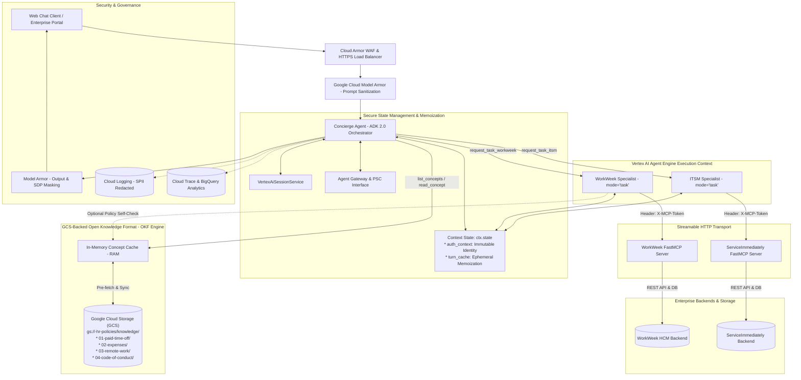

# System Architecture: Enterprise HR Multi-Agent System (ADK 2.0 - v3.1)

## Overview
The Enterprise HR Multi-Agent System provides seamless, AI-orchestrated access to HR policy documents, WorkWeek HCM self-service operations, and ServiceImmediately IT service desk management using **ADK 2.0**, **Vertex AI Agent Engine**, **Google Cloud Model Armor**, and a **GCS-Backed Open Knowledge Format (OKF)** knowledge engine.

---

## 1. System Topology & Data Flow



---

## 2. ADK 2.0 Component Breakdown

### A. Concierge Agent (Root Dispatcher & Policy Answerer)
- **Framework:** `google.adk.agents.Agent` (ADK 2.0)
- **Model:** `gemini-3.5-flash`
- **Hosting:** Vertex AI Agent Engine (Agent Runtime)
- **State Anchoring:** Extracts authenticated identity on turn entry and locks into `ctx.state["auth_context"]`.
- **Direct Tools:** `list_concepts()` and `read_concept(concept_id)` operating over the in-memory GCS OKF cache.
- **Functionality:** Answers HR policy questions deterministically in a single turn with exact footnote citations, delegates transactional tasks to specialized domain agents via typed `request_task_{name}` tools, manages multi-turn context with `VertexAiSessionService`, and compiles user-facing answers with clear confirmation cards.

### B. WorkWeek Specialist Agent (`mode="task"`)
- **Model:** `gemini-3.5-flash`
- **Output Schema:** `WorkWeekTaskOutput` (Pydantic model)
- **State Integration:** Leverages `ctx.state["turn_cache"]` for base profile memoization within a single turn, eliminating duplicate REST round-trips in multi-step workflows (e.g. UC-2.1/2.3).
- **FastMCP Tools (7/7):** `get_current_employee_id`, `get_personal_info`, `update_personal_info`, `get_employee_balances`, `request_time_off`, `get_leave_requests`, `cancel_leave_request`.
- **FastMCP Resources (2/2):** `workweek://employees/{id}/profile`, `workweek://employees/{id}/timeoff`.
- **REST APIs:** `PUT .../requests/{id}` (modify leave), `GET .../feedback` (feedback history).
- **Guardrails:** Validates remaining leave balance prior to booking, enforces chronological date validation (`start_date >= today`, `start_date <= end_date`), and checks contact formatting.

### C. ITSM Specialist Agent (`mode="task"`)
- **Model:** `gemini-3.5-flash`
- **Output Schema:** `ITSMTaskOutput` (Pydantic model)
- **Identity Binding:** Binds `requested_by` strictly from `ctx.state["auth_context"]["employee_id"]` to prevent parameter tampering.
- **FastMCP Tools (4/4):** `list_tickets`, `create_ticket`, `add_ticket_comment`, `update_ticket_status`.
- **FastMCP Resources (1/1):** `serviceimmediately://tickets/{id}`.
- **State Machine Guardrails:**
  - `New -> In Progress/Closed` (Allowed)
  - `In Progress -> Resolved/Closed` (Allowed)
  - `Resolved -> In Progress/Closed` (Allowed)
  - `Closed -> *` (Terminal / Blocked)
  - 5-minute duplicate submission mitigation, Critical priority outage verification.

### D. Google Cloud Model Armor (Security & Inspection)
- **Input Sanitization:** Intercepts prompt injection, jailbreaks, malicious URLs, and toxicity before invoking LLMs ($<25\text{ms}$).
- **Output Inspection & Sensitive Data Protection (SDP):** Scans model outputs, applies automated masking to SPII (SSNs, phone numbers, home addresses), and blocks data exfiltration ($<20\text{ms}$).

---

## 3. FastMCP Streamable HTTP Transport & Headers

Due to Google Frontend (GFE) intercepting standard Authorization headers, FastMCP connections require passing authentication tokens via `X-MCP-Token`:

```python
from google.adk.agents import Agent
from google.adk.tools.mcp_tool import McpToolset
from google.adk.tools.mcp_tool.mcp_session_manager import StreamableHTTPConnectionParams

# Connect to WorkWeek FastMCP server statelessly
workweek_mcp = McpToolset(
    connection_params=StreamableHTTPConnectionParams(
        url="https://mock-saas.aishprabhat.demo.altostrat.com/work-week/mcp/",
        headers={"X-MCP-Token": "mcp_your_token_here"}
    )
)

# Connect to ServiceImmediately FastMCP server statelessly
serviceimmediately_mcp = McpToolset(
    connection_params=StreamableHTTPConnectionParams(
        url="https://mock-saas.aishprabhat.demo.altostrat.com/service-immediately/mcp/",
        headers={"X-MCP-Token": "mcp_your_token_here"}
    )
)
```
