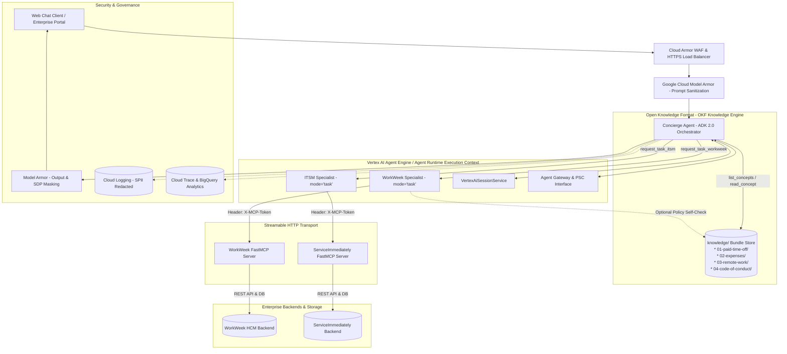

# Enterprise HR Multi-Agent System (MVP 1)

This repository contains the architecture specifications, solution design documents, and implementation plans for the **Enterprise HR Multi-Agent Assistant**, built on the **Google Agent Development Kit (ADK 2.0)**, **Vertex AI Agent Engine**, **Google Cloud Model Armor**, and the **Open Knowledge Format (OKF)** knowledge engine.

---

## 📑 Core Documentation Index

| Document | Description |
| :--- | :--- |
| [**`SOLUTION_DESIGN_DOCUMENT.md`**](./SOLUTION_DESIGN_DOCUMENT.md) | **Master MVP Solution Design Document (SDD)** covering all 10 standard enterprise sections: Scope Boundaries, Multi-Agent Architecture, OKF Knowledge Engine, Model Armor Security, FastMCP Integrations, FinOps, Deployment Plan, Risk Matrix, and Quality Evaluation. |
| [**`ARCHITECTURE.md`**](./ARCHITECTURE.md) | High-level system topology diagrams, sequence flows, component breakdowns, FastMCP transport protocols, and ADK 2.0 task delegation specifications. |
| [**`.agents-cli-spec.md`**](./.agents-cli-spec.md) | Machine-readable ADK 2.0 agent configuration manifest, Pydantic schemas, and token administration specs. |
| [**`knowledge_retrieval_strategy_plan.md`**](./knowledge_retrieval_strategy_plan.md) | Implementation plan and comparative analysis between Open Knowledge Format (OKF) and Traditional Vector RAG. |
| [**`walkthrough.md`**](./walkthrough.md) | Design walkthrough and milestone summary. |

---

## 🏛️ Architecture Overview

---

## 🚀 Key Highlights

1. **ADK 2.0 Multi-Agent Framework:**
   - `concierge_agent` (Root Orchestrator with `gemini-3.5-flash`).
   - `workweek_specialist` (`mode="task"`) covering all 7 FastMCP tools and 2 FastMCP resources (`workweek://`).
   - `itsm_specialist` (`mode="task"`) governing incident lifecycles, duplicate suppression, and state machines (`Closed -> *` terminal lock).
2. **Open Knowledge Format (OKF):**
   - 100% deterministic grounding, exact footnote citations, and zero vector search infrastructure costs.
3. **Google Cloud Model Armor:**
   - Sub-50ms prompt injection/jailbreak detection and Sensitive Data Protection (SDP) SPII redaction.
4. **Vertex AI Agent Engine (`agent_runtime`):**
   - Serverless managed deployment with native `VertexAiSessionService` state persistence.
