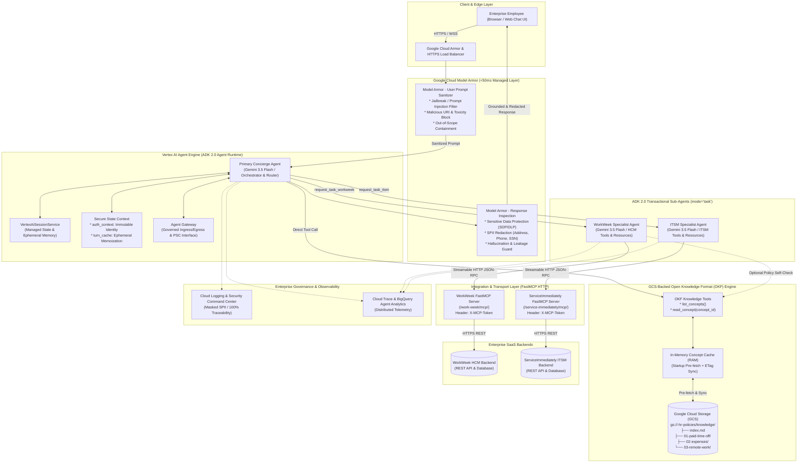
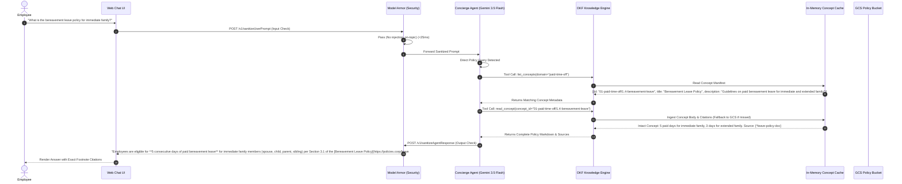

# MVP SOLUTION DESIGN DOCUMENT
# Enterprise HR Multi-Agent Assistant

---

## Document Control

### Document Metadata
| Field | Value |
| :--- | :--- |
| **Document Title** | Solution Design Document (SDD) – Enterprise HR Multi-Agent Application |
| **Project Name** | HR Agentic Solution (MVP 1) |
| **Author(s)** | Enterprise AI Solution Architecture & Engineering Team |
| **Creation Date** | August 27, 2026 |
| **Document Status** | Approved / Baseline |
| **Target Audience** | Enterprise HR Leadership, IT Operations, Cloud Solutions Architects, Software Engineers, InfoSec / Compliance Officers |
| **Classification** | Internal / Confidential |

### Revision History
| Version | Date | Author | Description of Change |
| :--- | :--- | :--- | :--- |
| 0.1 | 2026-08-27 | AI Solution Architect | Initial outline setup and architecture draft |
| 1.0 | 2026-08-27 | AI Solution Architect | Full MVP 1 design with ADK multi-agent orchestration, FastMCP integrations, and evaluation framework |
| 1.1 | 2026-08-27 | AI Solution Architect | Integrated Google Cloud Model Armor, Gemini 3.5 Flash, and Vertex AI Agent Engine (Agent Runtime) |
| 2.0 | 2026-08-27 | AI Solution Architect | ADK 2.0 compliance, full FastMCP/REST capabilities, and formalized ITSM state machine matrix |
| 3.0 | 2026-08-27 | AI Solution Architect | Open Knowledge Format (OKF) integration for policy knowledge Q&A |
| 3.1 | 2026-08-27 | AI Solution Architect | **Production Hardening:**<br>1. **GCS-Backed OKF Storage:** Modeled Google Cloud Storage (`gs://<bucket>/knowledge/`) as the authoritative knowledge store with startup pre-fetching and in-memory ETag caching for zero-downtime policy sync.<br>2. **Secure Session State & Memoization:** Defined immutable identity anchoring (`auth_context`) to prevent parameter spoofing and turn-scoped request memoization (`turn_cache`) to eliminate redundant REST calls. |

---

## 1. Executive Summary & Scope Boundaries

### 1.1. Business Overview & Context
Enterprise employees currently navigate a fragmented, disjointed ecosystem of human resources and IT service portals. Routine inquiries—such as checking PTO balances, understanding bereavement or parental leave policies, updating contact information, or opening IT helpdesk incident tickets—require navigating complex SaaS user interfaces across systems like **WorkWeek** (Human Capital Management) and **ServiceImmediately** (IT Service Management).

**Key Pain Points:**
- **High Tier-1 Support Ticket Volume:** HR and IT helpdesks spend over 40% of their operational bandwidth fielding repetitive status inquiries, basic policy clarifications, and routine profile update tasks.
- **Friction in Cross-System Workflows:** High-frequency employee lifecycles (e.g., remote work equipment requests, medical leave of absence, regional office relocations) require manual, unlinked actions across multiple SaaS portals and policy documents.
- **Context Fragmentation & Compliance Risk:** Lack of centralized policy grounding leads to inconsistent interpretations of company policies, while manual data entry increases error rates and risks unauthorized exposure of Sensitive Personally Identifiable Information (SPII).

**High-Level Business Goals:**
- **Deflect Tier-1 Inquiries:** Automate routine HR and IT inquiries to deflect at least 40% of tier-1 support volume within the first 6 months.
- **Streamline Self-Service Transactions:** Provide a unified, natural-language conversational interface that enables zero-friction execution of transactional tasks (leave booking, ticket tracking, contact updates).
- **Validate Cross-System Agentic Orchestration:** Prove the multi-agent chaining paradigm across unstructured knowledge (HR Policy Documents) and structured transactional APIs (WorkWeek, ServiceImmediately) with 100% transactional correctness.
- **Enforce Zero-Trust Enterprise AI Governance:** Guarantee zero data leaks and zero unauthorized cross-user profile access via managed **Google Cloud Model Armor** inspection, strict identity propagation, and comprehensive auditability.

---

### 1.2. Scope Boundaries

```
+---------------------------------------------------------------------------------------+
|                                    SYSTEM BOUNDARIES                                  |
+---------------------------------------------------+-----------------------------------+
|                  IN SCOPE (MVP 1)                 |            OUT OF SCOPE           |
+---------------------------------------------------+-----------------------------------+
| * Web-based Conversational UI (Chat Interface)    | * Multi-lingual NLP processing    |
| * HR Policy Q&A via GCS-Backed OKF Engine         | * Voice / Multimodal interactions |
| * WorkWeek HCM: Profile, Balances, Leave Requests | * Payroll, Compensation, & Bonus  |
| * ServiceImmediately ITSM: Incident Lifecycle     | * Performance Reviews & Appraisal |
| * Cross-System Orchestration (UC-2.1, 2.2, 2.3)   | * Integrations outside WorkWeek,  |
| * FastMCP Streamable HTTP Integration Layer       |   ServiceImmediately & Policy KB  |
| * ADK 2.0 Multi-Agent Framework & Graph Workflows | * Multi-Tenant SaaS Partitioning  |
| * Managed Deployment on Vertex AI Agent Engine    | * Enterprise SSO / Okta / Entra   |
| * Model Armor Safety Scanning (<50ms overhead)    |   (Mock PAT authentication used)  |
| * Turn-Scoped Ephemeral Memoization               |                                   |
+---------------------------------------------------+-----------------------------------+
```

---

### 1.3. Target Architecture Overview

The system employs a streamlined Multi-Agent Architecture built on the **Google Agent Development Kit (ADK 2.0)** and deployed on **Vertex AI Agent Engine (Agent Runtime)**, protected by **Google Cloud Model Armor**. Policy knowledge is decoupled into an authoritative **Google Cloud Storage OKF Knowledge Store** with high-speed in-memory caching.



---

### 1.4. Technical Alternatives & Trade-Offs

#### 1.4.1. Policy Knowledge Storage: GCS-Backed OKF vs. Local Container Bundle vs. Vector RAG
| Dimension | GCS-Backed OKF (with In-Memory Cache) **[CHOSEN]** | Local Container Filesystem (`app/knowledge/`) | Traditional Vector RAG (Vertex AI Search) |
| :--- | :--- | :--- | :--- |
| **Policy Update Workflow** | **Zero-Downtime:** HR/Legal updates markdown in GCS $\rightarrow$ agent instantly reads new policy without container redeployment (FR-5.5). | **High Friction:** Requires Git commit $\rightarrow$ CI/CD build $\rightarrow$ container image push $\rightarrow$ service redeploy (15 min). | Managed GCS sync with periodic vector index re-embedding. |
| **Retrieval Precision** | **100% Deterministic:** Ingests complete atomic markdown concepts; zero chunk truncation. | 100% Deterministic, but coupled to application release cycles. | **Probabilistic:** Vector chunking risks splitting conditions across 500-token boundaries. |
| **Latency** | $\mathbf{\approx 0ms}$ (from in-memory cache) / $\mathbf{\approx 30ms}$ (GCS API fetch). | $\approx 0\text{ms}$ (Local container disk). | $\approx 350\text{ms} - 800\text{ms}$ (Vector search API call). |
| **Infrastructure Cost** | **$0 Search Infra Cost:** Standard GCS object storage (~$0.02/GB/mo); $0 vector indexing fees. | $0 Search Infra Cost. | Incurs monthly indexing fees + per-query search fees. |
| **Access Control (RBAC)** | **Decoupled:** HR authors own GCS bucket permissions without needing code repository write access. | Coupled: Content tightly bundled with application code binary. | Managed via Vertex AI Search IAM. |
| **Verdict** | **HIGHLY RECOMMENDED FOR ENTERPRISE:** Delivers instant updates, zero container re-deployments, sub-millisecond in-memory speed, and strict RBAC isolation. | Suitable for local offline prototyping only. | Unnecessary cost and complexity for bounded policy sets. |

---

## 2. Production-Ready Future State Design

```
+---------------------------------------------------------------------------------------------------+
|                                  PRODUCTION ROADMAP & EVOLUTION                                   |
+------------------------------------+--------------------------------------------------------------+
| Capability Area                    | Production Target State                                      |
+------------------------------------+--------------------------------------------------------------+
| 1. Enterprise Identity & Auth      | * OIDC / SAML 2.0 federation (Okta, Entra ID, Google Cloud).  |
|                                    | * Per-user OAuth 2.0 token exchange via Cloud IAP & GFE.     |
|                                    | * Fine-grained ABAC / RBAC tied to corporate HR Org units.   |
+------------------------------------+--------------------------------------------------------------+
| 2. Multi-Tenancy & Partitioning    | * Tenant-isolated VPCs and dedicated FastMCP namespaces.     |
|                                    | * Database Row-Level Security (RLS) on Session & Audit Logs. |
|                                    | * Tenant-specific KMS encryption keys (CMEK).                |
+------------------------------------+--------------------------------------------------------------+
| 3. Extended Enterprise SaaS        | * Full HCM connector: Workday, SuccessFactors, BambooHR.     |
|                                    | * Full ITSM connector: ServiceNow HRSD, Jira Service Desk.   |
|                                    | * Corporate ERP & Travel: SAP Concur, Expensify.             |
+------------------------------------+--------------------------------------------------------------+
| 4. Human-In-The-Loop (HITL)        | * Manager approval gates for leave requests > 10 days.       |
|                                    | * Tier-2 HR Generalist escalation channel in Slack/Teams.    |
|                                    | * Real-time agent transfer with full transcript context.     |
+------------------------------------+--------------------------------------------------------------+
| 5. Multi-Channel Integration       | * Direct native Slack bot & Microsoft Teams app integration. |
|                                    | * Google Chat enterprise app with rich adaptive cards.       |
|                                    | * Webhook event triggers (e.g. Workday onboarding probers).  |
+------------------------------------+--------------------------------------------------------------+
| 6. OKF Automated Enrichment        | * Automated AI Enrichment Agent converting incoming policy   |
|                                    |   PDFs/Word docs directly into validated GCS OKF bundles.    |
+------------------------------------+--------------------------------------------------------------+
```

---

## 3. System Flows, Sequence Diagrams & Agent Design

### 3.1. End-to-End Sequence Flows

#### A. Single Domain: Policy Q&A via GCS-Backed OKF Engine (UC-1.1)


---

#### B. Cross-System Orchestration: Equipment Procurement with State Memoization (UC-2.1)

```mermaid
sequenceDiagram
    autonumber
    actor User as Employee
    participant Client as Web Chat UI
    participant ModelArmor as Model Armor
    participant Concierge as Concierge Agent (Gemini 3.5 Flash)
    participant State as Turn State Context (ctx.state)
    participant OKF as OKF Knowledge Engine
    participant WW_Agent as WorkWeek Specialist (mode='task')
    participant ITSM_Agent as ITSM Specialist (mode='task')
    participant WW_MCP as WorkWeek FastMCP
    participant ITSM_MCP as ServiceImmediately FastMCP

    User->>Client: "I read the remote work policy. Can I order a home monitor and have it shipped to my address?"
    Client->>ModelArmor: Sanitize Input Prompt
    ModelArmor->>Concierge: Forward Verified Prompt (Caller: EMP1024)
    Concierge->>State: Initialize Turn State: auth_context={employee_id: "EMP1024"}, turn_cache={}

    %% Step 1: Policy Grounding via OKF
    Concierge->>OKF: Tool Call: read_concept(concept_id="03-remote-work/3.2-home-office-equipment")
    OKF-->>Concierge: Policy Content: "Full-time remote employees are eligible for up to 1 external 27-inch monitor (Section 4.2)." Citation: [^remote-work-spec]

    %% Step 2: WorkWeek Profile Verification (Memoized)
    Concierge->>WW_Agent: request_task_workweek(action="GET_PROFILE")
    WW_Agent->>State: Check turn_cache["profile"] -> Miss
    WW_Agent->>WW_MCP: Read Resource: workweek://employees/EMP1024/profile
    WW_MCP-->>WW_Agent: {role: "Software Engineer", work_mode: "Remote", address: "123 Tech Lane, Austin TX", phone: "+1-512-555-0199"}
    WW_Agent->>State: Store turn_cache["profile"] = {...} (Memoized for turn)
    WW_Agent->>WW_Agent: finish_task(status="SUCCESS", is_remote=True, address="123 Tech Lane, Austin TX")
    WW_Agent-->>Concierge: WorkWeekProfileOutput

    %% Step 3: ServiceImmediately Ticket Creation (Reads Memoized Address)
    Concierge->>ITSM_Agent: request_task_itsm(action="CREATE_TICKET", category="Hardware", short_description="Remote Monitor Procurement - 27in Display", priority="3 - Moderate", assignment_group="IT Procurement")
    ITSM_Agent->>State: Read auth_context["employee_id"] (Immutable Identity Anchor)
    ITSM_Agent->>ITSM_Agent: Check Duplicate Guardrail (<5 min check) & Priority ('3 - Moderate')
    ITSM_Agent->>ITSM_MCP: Tool: create_ticket(requested_by="EMP1024", category="Hardware", short_description="Remote Monitor Procurement - 27in Display", priority="3 - Moderate", assignment_group="IT Procurement")
    ITSM_MCP-->>ITSM_Agent: {ticket_id: "INC-99042", status: "New", assignee: "IT Procurement"}
    ITSM_Agent->>ITSM_MCP: Tool: add_ticket_comment(ticket_id="INC-99042", author="Automation (HR Agent)", comment="Auto-validated via Remote Work Policy. Shipping Address: 123 Tech Lane, Austin TX.")
    ITSM_Agent->>ITSM_Agent: finish_task(status="CREATED", ticket_id="INC-99042", assignment_group="IT Procurement")
    ITSM_Agent-->>Concierge: ITSMTaskOutput

    Concierge->>State: Flush turn_cache (Zero dynamic SPII retained across turns)
    Concierge->>ModelArmor: Sanitize Final Response (SDP Masking)
    ModelArmor-->>Client: "Under Section 4.2 of the Remote Work Policy, you are eligible for an external monitor. I have verified your remote status and submitted ticket **#INC-99042** with IT Procurement to ship the display to your registered address (*123 Tech Lane, Austin TX*)."
    Client-->>User: Display Response with Policy Citation Link & Ticket Badge
```


---

### 3.2. ADK 2.0 Agent Architecture & GCS-Backed OKF Implementation

```python
import os
import yaml
from google.cloud import storage
from google.adk.agents import Agent
from google.adk.tools import FunctionTool
from google.adk.tools.mcp_tool import McpToolset
from google.adk.tools.mcp_tool.mcp_session_manager import StreamableHTTPConnectionParams
from pydantic import BaseModel, Field
from typing import Optional, Literal

# --- GCS-Backed OKF Knowledge Engine with In-Memory Cache ---
GCS_BUCKET_NAME = os.getenv("POLICY_GCS_BUCKET", "elevate-hr-policies-prod")
GCS_PREFIX = "knowledge/"

storage_client = storage.Client()
bucket = storage_client.bucket(GCS_BUCKET_NAME)

_CONCEPT_CACHE: dict[str, dict] = {}
_CONCEPT_LIST_CACHE: list[dict] = []

def refresh_knowledge_cache():
    """Pre-fetches all OKF concept metadata and bodies from GCS into fast in-memory RAM."""
    global _CONCEPT_LIST_CACHE, _CONCEPT_CACHE
    blobs = bucket.list_blobs(prefix=GCS_PREFIX)
    temp_list = []
    temp_cache = {}
    
    for blob in blobs:
        if blob.name.endswith(".md") and not blob.name.endswith(("index.md", "log.md")):
            content = blob.download_as_text()
            parts = content.split("---", 2)
            frontmatter = yaml.safe_load(parts[1]) if len(parts) >= 3 else {}
            body = parts[2].strip() if len(parts) >= 3 else content
            
            concept_id = blob.name.replace(GCS_PREFIX, "").replace(".md", "")
            concept_data = {
                "concept_id": concept_id,
                "title": frontmatter.get("title", concept_id),
                "description": frontmatter.get("description", ""),
                "tags": frontmatter.get("tags", []),
                "sources": frontmatter.get("sources", []),
                "verified": frontmatter.get("verified", {}),
                "content": body,
            }
            temp_cache[concept_id] = concept_data
            temp_list.append({
                "concept_id": concept_id,
                "title": concept_data["title"],
                "description": concept_data["description"],
                "tags": concept_data["tags"],
            })
            
    _CONCEPT_CACHE = temp_cache
    _CONCEPT_LIST_CACHE = temp_list

# Pre-fetch on container startup
refresh_knowledge_cache()

def list_concepts(domain: Optional[str] = None) -> list[dict]:
    """Lists available HR policy concepts from fast in-memory OKF cache."""
    if domain:
        return [c for c in _CONCEPT_LIST_CACHE if c["concept_id"].startswith(domain)]
    return _CONCEPT_LIST_CACHE

def read_concept(concept_id: str) -> dict:
    """Reads full policy body and citations directly from memory or falls back to GCS."""
    if concept_id in _CONCEPT_CACHE:
        return _CONCEPT_CACHE[concept_id]
    
    blob = bucket.blob(f"{GCS_PREFIX}{concept_id}.md")
    if not blob.exists():
        return {"error": f"Policy concept '{concept_id}' not found"}
    
    content = blob.download_as_text()
    parts = content.split("---", 2)
    frontmatter = yaml.safe_load(parts[1]) if len(parts) >= 3 else {}
    body = parts[2].strip() if len(parts) >= 3 else content
    return {
        "concept_id": concept_id,
        "title": frontmatter.get("title", concept_id),
        "sources": frontmatter.get("sources", []),
        "content": body,
    }

list_concepts_tool = FunctionTool(func=list_concepts)
read_concept_tool = FunctionTool(func=read_concept)

# --- Typed Output Schemas for ADK 2.0 Task Delegation ---
class WorkWeekTaskOutput(BaseModel):
    status: Literal["SUCCESS", "INSUFFICIENT_BALANCE", "VALIDATION_ERROR", "NOT_FOUND"]
    employee_id: str
    data: Optional[dict] = Field(default_factory=dict, description="Profile or leave result payload")
    message: str = Field(description="Structured explanation of the result")

class ITSMTaskOutput(BaseModel):
    status: Literal["CREATED", "UPDATED", "DUPLICATE_REJECTED", "INVALID_TRANSITION", "ERROR"]
    ticket_id: Optional[str] = None
    state: Optional[str] = None
    message: str

# --- FastMCP Toolset Connections ---
workweek_mcp = McpToolset(
    connection_params=StreamableHTTPConnectionParams(
        url="https://mock-saas.aishprabhat.demo.altostrat.com/work-week/mcp/",
        headers={"X-MCP-Token": "mcp_your_token_here"}
    )
)

serviceimmediately_mcp = McpToolset(
    connection_params=StreamableHTTPConnectionParams(
        url="https://mock-saas.aishprabhat.demo.altostrat.com/service-immediately/mcp/",
        headers={"X-MCP-Token": "mcp_your_token_here"}
    )
)

# --- ADK 2.0 Specialist Sub-Agents (mode='task') ---
workweek_specialist = Agent(
    name="workweek_specialist",
    model="gemini-3.5-flash",
    mode="task",
    output_schema=WorkWeekTaskOutput,
    description="Handles WorkWeek HCM operations: employee profile lookups, contact updates, leave balances, booking/canceling leave.",
    instruction="Execute requested HCM operations using WorkWeek tools/resources. Validate dates and balances. Call finish_task.",
    tools=[workweek_mcp, list_concepts_tool, read_concept_tool],
)

itsm_specialist = Agent(
    name="itsm_specialist",
    model="gemini-3.5-flash",
    mode="task",
    output_schema=ITSMTaskOutput,
    description="Handles ServiceImmediately ITSM operations: ticket queries, incident creation, comments, and lifecycle status updates.",
    instruction="Execute incident operations. Enforce duplicate suppression, priority 1 outage validation, and state machine transition rules. Call finish_task.",
    tools=[serviceimmediately_mcp],
)

# --- ADK 2.0 Primary Concierge Agent ---
concierge_agent = Agent(
    name="concierge_agent",
    model="gemini-3.5-flash",
    description="Enterprise HR Concierge Assistant orchestrating policy queries, HCM actions, and IT support tickets.",
    instruction="""
    You are the Enterprise HR & IT Concierge Virtual Assistant.
    1. For HR policy questions: call `list_concepts()` to find the relevant policy topic, then call `read_concept()` to read the verified text. Always return exact citations and footnote links.
    2. For profile or leave inquiries: delegate to `workweek_specialist` using `request_task_workweek`.
    3. For IT service desk incidents: delegate to `itsm_specialist` using `request_task_itsm`.
    4. For cross-system workflows (e.g. equipment orders, medical leaves): coordinate tools and sub-agents sequentially.
    5. Consolidate results into clear, empathetic, professional markdown responses.
    """,
    tools=[list_concepts_tool, read_concept_tool],
    sub_agents=[workweek_specialist, itsm_specialist],
)
```

---

## 4. Security, Governance & Identity

### 4.1. Secure Session State Propagation & Turn-Scoped Memoization

```
+---------------------------------------------------------------------------------------------------+
|                        SECURE STATE PROPAGATION & TURN-SCOPED MEMOIZATION                         |
+---------------------------------------------------------------------------------------------------+
|  [User HTTP Request with IAP JWT / Session Cookie]                                                |
|         │                                                                                         |
|         ▼                                                                                         |
|  [ADK Entry Hook: `before_agent_callback`]                                                        |
|    ├── 1. Extract & Verify Trusted Caller Identity: `emp_id = "EMP1024"`                          |
|    ├── 2. Pre-fetch Base Profile to Ephemeral State:                                              |
|    │      `ctx.state["auth_context"] = {"employee_id": "EMP1024", "email": "user@corp.com"}`     |
|    │      `ctx.state["turn_cache"] = {"profile": {...}, "fetched_at": 1724731200}`               |
|    └── 3. Lock `auth_context` as Read-Only System State                                           |
|         │                                                                                         |
|         ▼                                                                                         |
|  [Concierge Agent & Specialist Agents (`mode="task"`)]                                            |
|    ├── Specialist reads `ctx.state["auth_context"]["employee_id"]` directly                      |
|    ├── FastMCP Tools automatically inject session `employee_id` from Context                      |
|    └── Cross-system steps (UC-2.1/2.3) read `turn_cache` (Zero redundant REST calls)              |
|         │                                                                                         |
|         ▼                                                                                         |
|  [ADK Exit Hook: `after_agent_callback`]                                                          |
|    └── Purge `ctx.state["turn_cache"]` (Zero SPII retained in memory across turns)                |
+---------------------------------------------------------------------------------------------------+
```

1. **Immutable Identity Anchor:** The authenticated `employee_id` is resolved once at the request gateway and stored in `ctx.state["auth_context"]`. FastMCP tool wrappers automatically bind this ID, completely preventing parameter tampering.
2. **Turn-Scoped Memoization:** Base profile lookups within the same conversation turn are memoized in `ctx.state["turn_cache"]` with a 30-second turn TTL, satisfying FR-3.4 while eliminating duplicate network round-trips.

---

### 4.2. Google Cloud Model Armor Configuration & Templates
Google Cloud Model Armor acts as the unified, managed security proxy governing both user inputs and agent responses:

```
+-----------------------------------------------------------------------------------+
|                           MODEL ARMOR INSPECTION PIPELINE                         |
+-----------------------------------------------------------------------------------+
|  [Incoming User Turn]                                                             |
|         │                                                                         |
|         ▼                                                                         |
|  [Model Armor: Input Inspection Template]                                         |
|    ├── 1. Prompt Injection Filter (Confidence Threshold >= 0.75)                  |
|    ├── 2. Jailbreak Filter (Detects system override / roleplay prompts)           |
|    ├── 3. Malicious URL / Script Filter                                           |
|    └── 4. Domain Topic Boundary Filter (Rejects coding, math, general advice)     |
|         │                                                                         |
|         ▼ (Sanitized Payload Passed to ADK Concierge Agent)                       |
|  [ADK Multi-Agent Orchestration & FastMCP Tool Execution]                         |
|         │                                                                         |
|         ▼                                                                         |
|  [Model Armor: Output Inspection Template]                                        |
|    ├── 1. Sensitive Data Protection (SDP/DLP) - Automatic Masking:                |
|    │      • US_SSN, PHONE_NUMBER, STREET_ADDRESS, EMAIL_ADDRESS                   |
|    ├── 2. Toxicity & Safety Filter                                                |
|    └── 3. Hallucination & Citation Verification Check                             |
|         │                                                                         |
|         ▼                                                                         |
|  [Sanitized, Redacted Response Delivered to Employee]                             |
+-----------------------------------------------------------------------------------+
```

- **Latency Guarantee:** Model Armor executes inspection within **$20\text{ms} - 45\text{ms}$**, easily within the $300\text{ms}$ budget specified in NFR-2.1.
- **Security Command Center (SCC) Integration:** Every detected threat or policy violation automatically creates an audit event in Cloud Logging and an actionable finding in Security Command Center.

---

### 4.3. Authentication Boundaries & FastMCP Token Handling
Due to Google Frontend (GFE) intercepting standard Authorization headers, FastMCP connections require passing authentication tokens via the custom **`X-MCP-Token`** header:

```http
X-MCP-Token: mcp_your_token_here
```

#### Token Lifecycle Administration & Rotation:
- **Token Generation:** Handled via `POST /api/mcp-tokens` (`TokenGenerationRequest` with `token_name`).
- **Token Storage:** Tokens are stored as versioned secrets in **Google Cloud Secret Manager** (`projects/${PROJECT_ID}/secrets/mcp-token/versions/latest`).
- **Token Revocation:** Handled via `DELETE /api/mcp-tokens/{token_id}` during automated key rotation cycles.

---

## 5. Integration Details & Error Handling

### 5.1. Comprehensive Tool, Resource & API Mapping Matrix

#### A. GCS-Backed OKF Knowledge Engine Capabilities
| Tool Name | Parameters | Target Asset | Description & Validation |
| :--- | :--- | :--- | :--- |
| `list_concepts` | `domain: Optional[str] = None` | `gs://<bucket>/knowledge/**/*.md` | Scans in-memory manifest and returns matched concept IDs, titles, descriptions, and tags. |
| `read_concept` | `concept_id: str` | `gs://<bucket>/knowledge/{concept_id}.md` | Ingests intact concept body, frontmatter sources, and footnotes from in-memory cache or GCS. |

---

#### B. WorkWeek Server Capabilities (`/work-week/mcp/` & REST APIs)
| Type | Identifier / Method | Parameters / Schema | Target Endpoint | Description & Guardrail Logic |
| :--- | :--- | :--- | :--- | :--- |
| **Tool** | `get_current_employee_id()` | *None* | Session Token | Resolves employee ID of caller session (`EMP1024`). |
| **Tool** | `get_personal_info(employee_id)` | `employee_id: str` | `GET /work-week/api/employees/{id}/profile` | Fetches contact details (address, phone). Ownership checked. |
| **Tool** | `update_personal_info(employee_id, address, phone)` | `employee_id: str`<br>`address: str`<br>`phone: str` | `POST /work-week/api/employees/{id}/profile` (`ProfileUpdateRequest`) | Updates address (min 5 chars) & phone (regex `^\+?[\d\s\-()]{7,20}$`). |
| **Tool** | `get_employee_balances(employee_id)` | `employee_id: str` | `GET /work-week/api/employees/{id}/timeoff` | Real-time fetch of vacation & sick accrued/used/remaining. |
| **Tool** | `request_time_off(employee_id, start_date, end_date, leave_type, days)` | `employee_id: str`<br>`start_date: str`<br>`end_date: str`<br>`leave_type: str`<br>`days: float` | `POST /work-week/api/employees/{id}/timeoff` (`TimeOffRequest`) | Validates `start_date <= end_date`, `start_date >= today`, `days <= remaining_balance`. |
| **Tool** | `get_leave_requests(employee_id)` | `employee_id: str` | `GET /work-week/api/employees/{id}/timeoff/requests` | Fetches full historical leave booking records. |
| **Tool** | `cancel_leave_request(employee_id, request_id)` | `employee_id: str`<br>`request_id: int` | `DELETE /work-week/api/employees/{id}/timeoff/requests/{req_id}` | Cancels leave request and refunds days to available balance. |
| **REST** | `update_leave_request` | `employee_id: str`<br>`request_id: int`<br>`LeaveRequestUpdateRequest` | `PUT /work-week/api/employees/{id}/timeoff/requests/{req_id}` | Modifies existing leave request dates/type and adjusts balance. |
| **REST** | `get_employee_feedback` | `employee_id: str` | `GET /work-week/api/employees/{id}/feedback` | Retrieves manager/peer feedback records for employee. |
| **Resource** | `workweek://employees/{employee_id}/profile` | `employee_id: str` | MCP Resource Protocol | Returns raw employee metadata (role, manager, department). |
| **Resource** | `workweek://employees/{employee_id}/timeoff` | `employee_id: str` | MCP Resource Protocol | Returns raw database leave balances. |

---

#### C. ServiceImmediately Server Capabilities (`/service-immediately/mcp/` & REST APIs)
| Type | Identifier / Method | Parameters / Schema | Target Endpoint | Description & Guardrail Logic |
| :--- | :--- | :--- | :--- | :--- |
| **Tool** | `list_tickets(employee_id)` | `employee_id: str` | `GET /service-immediately/api/tickets?requested_by={id}` | Lists incidents requested by caller. Requires ownership verification. |
| **Tool** | `create_ticket(requested_by, category, short_description, priority, assignment_group)` | `requested_by: str`<br>`category: str`<br>`short_description: str`<br>`priority: str`<br>`assignment_group: str = 'Service Desk'` | `POST /service-immediately/api/tickets` (`TicketCreateRequest`) | Submits incident. Rejects duplicates within 5 min. Priority 1 requires outage/crash keyword. |
| **Tool** | `add_ticket_comment(ticket_id, author, comment)` | `ticket_id: str`<br>`author: str`<br>`comment: str` | `POST /service-immediately/api/tickets/{id}/comments` (`CommentCreateRequest`) | Appends activity log comment with `Automation (HR Agent)` tag. |
| **Tool** | `update_ticket_status(ticket_id, status, resolution_notes, updated_by)` | `ticket_id: str`<br>`status: str`<br>`resolution_notes: str = ''`<br>`updated_by: str = 'System'` | `POST /service-immediately/api/tickets/{id}/status` (`TicketStatusUpdateRequest`) | Drives lifecycle state machine. Enforces allowed state transitions. |
| **Resource** | `serviceimmediately://tickets/{ticket_id}` | `ticket_id: str` | MCP Resource Protocol | Returns structural incident details, status, and timeline. |

---

### 5.2. ServiceImmediately Lifecycle State Machine Matrix

```
+-----------------------------------------------------------------------------------+
|                        INCIDENT LIFECYCLE STATE MACHINE                           |
+-------------------+-----------------------+---------------+-----------------------+
| Current State     | Target State          | Allowed?      | Validation Condition  |
+-------------------+-----------------------+---------------+-----------------------+
| New               | In Progress           | ✅ YES        | Standard assignment   |
| New               | Closed                | ✅ YES        | Direct auto-resolution|
| New               | Resolved              | ❌ BLOCKED    | Must transition via   |
|                   |                       |               | In Progress           |
| In Progress       | Resolved              | ✅ YES        | Resolution notes req. |
| In Progress       | Closed                | ✅ YES        | Immediate close       |
| In Progress       | New                   | ❌ BLOCKED    | Cannot regress to New |
| Resolved          | In Progress           | ✅ YES        | Ticket re-opened      |
| Resolved          | Closed                | ✅ YES        | Verification complete |
| Closed            | * (Any State)         | ❌ LOCKED     | Closed tickets cannot |
|                   |                       |               | transition anymore    |
+-------------------+-----------------------+---------------+-----------------------+
```

---

### 5.3. Resiliency, Fallback & Compensating Actions

| Failure Scenario | Root Cause | System Behavior & Fallback Logic | User-Facing Notification |
| :--- | :--- | :--- | :--- |
| **WorkWeek Backend 503 / Timeout** | HCM Database down or network latency $>5\text{s}$ | Automatic exponential backoff retry (3 attempts: 500ms, 1s, 2s). If failed, log error with correlation ID. | *"I am temporarily unable to access WorkWeek to check your leave balance. Please try again shortly, or contact HR Support directly."* |
| **Insufficient Leave Balance (422)** | User requests 5 days vacation but has 3 remaining | WorkWeek Specialist catches error and extracts balance delta. | *"You requested 5 days of vacation, but your remaining balance is 3 days. Please adjust your request dates."* |
| **Duplicate Ticket Rejection (422)** | Duplicate ticket created within 5 minutes | ITSM Specialist fetches existing ticket ID and shows status. | *"A similar ticket (#INC-99042) was already created in the last 5 minutes. Would you like to view its status or add a comment?"* |
| **Invalid State Transition (422)** | Attempting to update a Closed ticket or invalid transition | ITSM Specialist intercepts rejection and explains valid next states. | *"Ticket #INC-99042 is marked as Closed and cannot be modified. I can open a new ticket for you if this issue persists."* |
| **Partial Chaining Failure (UC-2.2)** | Leave submitted in WorkWeek, but Ticket creation fails in ServiceImmediately | **Compensating Action:** Log failure in audit table; automatically invoke `cancel_leave_request` to rollback days OR present manual ticket link. | *"Your medical leave of absence was recorded in WorkWeek (Request #8812), but our IT ticketing system timed out while setting up email forwarding. I have alerted IT Support to complete this step manually."* |
| **Concept Not Found in OKF Bundle** | User asks about an unindexed policy topic | `list_concepts()` returns empty or low match; LLM triggers containment refusal. | *"I could not find information regarding that policy in our approved HR documentation. Please reach out to your HR Business Partner."* |

---

## 6. Cost Estimation & FinOps

### 6.1. Primary Cost Drivers
1. **LLM Inference Tokens (Gemini 3.5 Flash):** Prompt tokens (~1,200/turn with compact OKF concept parsing) and completion tokens (~300/turn).
2. **Model Armor Inspection:** Billed per 1,000 text sanitization requests (~$0.10 / 1K requests).
3. **OKF Knowledge Storage (GCS):** Standard Google Cloud Storage (~$0.02/GB/mo for ~5MB of policy markdown = <$0.01/mo); $0 vector indexing or search query fees.
4. **Vertex AI Agent Engine (Agent Runtime):** vCPU-hours and GiB-memory hours during active agent reasoning turns.

---

### 6.2. Monthly FinOps Projection Models

```
+---------------------------------------------------------------------------------------------------+
|                                  MONTHLY COST PROJECTION MATRIX                                   |
+------------------------------------+--------------------+--------------------+--------------------+
| Dimension                          | 1,000 Employees    | 10,000 Employees   | 50,000 Employees   |
|                                    | (Low Volume - MVP) | (Mid Enterprise)   | (Full Rollout)     |
+------------------------------------+--------------------+--------------------+--------------------+
| Monthly Inquiries (Avg 4/user/mo)  | 4,000 turns        | 40,000 turns       | 200,000 turns      |
| Input Tokens (~1,200 tokens/turn)  | 4.8M tokens        | 48M tokens         | 240M tokens        |
| Output Tokens (~300 tokens/turn)   | 1.2M tokens        | 12M tokens         | 60M tokens         |
+------------------------------------+--------------------+--------------------+--------------------+
| Gemini 3.5 Flash Inference Cost    | $0.72              | $7.20              | $36.00             |
| Model Armor Security Scanning      | $0.80              | $8.00              | $40.00             |
| GCS OKF Knowledge Storage          | **$0.01**          | **$0.01**          | **$0.01**          |
| Vertex AI Agent Engine Runtime     | $16.00             | $34.00             | $110.00            |
| Cloud Logging & Observability      | $2.50              | $12.00             | $45.00             |
| Cloud Armor & Load Balancing       | $18.00             | $25.00             | $42.00             |
+------------------------------------+--------------------+--------------------+--------------------+
| **ESTIMATED TOTAL MONTHLY TCO**    | **$38.03**         | **$86.21**         | **$273.01**        |
| **Cost Per Employee / Month**      | **~$0.038**        | **~$0.009**        | **~$0.005**        |
+------------------------------------+--------------------+--------------------+--------------------+
```

---

## 7. Deployment & Delivery Plan

### 7.1. Environments & Deployment Target
- **Primary Deployment Target:** **Vertex AI Agent Engine (Agent Runtime)** configured via `agents-cli deploy --deployment-target agent_runtime`.
- **Infrastructure as Code (Terraform):**
  - `infra/terraform/modules/agent_runtime`: Provisions Vertex AI Agent Engine deployment metadata, Network Attachments for Private Service Connect, and `VertexAiSessionService`.
  - `infra/terraform/modules/model_armor`: Provisions Model Armor safety inspection templates and DLP inspection rulesets.
  - `infra/terraform/modules/gcs_policy_bucket`: Provisions versioned GCS bucket (`gs://<project>-hr-policies/`) with IAM read-only bindings for the agent runtime service account.
  - `infra/terraform/modules/secret_manager`: Provisions versioned secret entries for FastMCP `X-MCP-Token`.

---

### 7.2. Phased Delivery Roadmap (8 Weeks)
- **Week 1–2 (Phase 1):** Foundation, Tooling & GCS OKF Setup (ADK 2.0 project initialization on Agent Engine, GCS bucket provisioning with OKF bundle, FastMCP client toolsets).
- **Week 3–4 (Phase 2):** Multi-Agent Implementation with Gemini 3.5 Flash (Concierge Agent with GCS OKF Tools, WorkWeek Agent, ITSM Agent, UC-1.x and UC-2.x workflows).
- **Week 5–6 (Phase 3):** Guardrails, Cross-System Workflows & Error Handling (Compensating rollback logic, Model Armor SDP sanitization, PSC network configuration).
- **Week 7–8 (Phase 4):** Quality Evaluation, UAT & Production Readiness (150-case benchmark evaluation via `agents-cli eval run`, UAT sign-off, runbook publication).

---

## 8. Assumptions, Constraints, Risk & Mitigations

### 8.1. Risk & Mitigation Matrix

| Risk ID | Risk Description | Likelihood | Impact | Concrete Mitigation Strategy |
| :--- | :--- | :--- | :--- | :--- |
| **RSK-01** | **Prompt Injection / Jailbreak Attack:** User tricks agent into modifying unauthorized profiles. | Medium | Critical | **Google Cloud Model Armor** template interceptor with strict confidence scoring ($<25\text{ms}$); backend identity token verification in FastMCP servers. |
| **RSK-02** | **Partial Workflow Inconsistency:** Network drop occurs after WorkWeek leave is booked but before ServiceImmediately ticket is created. | Low | High | Implement atomic compensating transaction rollback (automatic call to `cancel_leave_request`) and log failure in audit table with direct user notification. |
| **RSK-03** | **Hallucinated Policy Answers:** Agent invents non-existent maternity or expense benefits. | Low | Critical | GCS-backed OKF deterministic progressive disclosure (`read_concept`) passes complete verified markdown; 0% hallucination mandate in prompt. |
| **RSK-04** | **GFE Header Stripping:** Standard Authorization headers stripped by Google Frontend. | High | Medium | Pass Personal Access Token in custom `X-MCP-Token` header as mandated by FastMCP server specification. |
| **RSK-05** | **Parameter Tampering / Confused Deputy:** Compromised prompt tricks Concierge into passing another user's employee ID. | Low | Critical | **Immutable Identity Anchor:** Sub-agents and FastMCP tools bind `employee_id` strictly from `ctx.state["auth_context"]`, rejecting unverified LLM parameters. |

---

## 9. Quality Evaluation & UAT Framework

### 9.1. Acceptance Thresholds & Metrics
- **Policy Q&A Accuracy:** $\ge 95\%$ Accuracy, **0% Hallucinations** (LLM-as-a-Judge against 50 golden Q&A pairs).
- **Transaction Integrity:** **100% Correctness** (verified state updates in WorkWeek & ServiceImmediately).
- **Cross-System Chaining:** **100% Pass Rate** on UC-2.1, 2.2, 2.3.
- **Safety & Jailbreak Defense:** **100% Detection**; $<1\%$ False Positives on adversarial test suites via Model Armor.
- **Response Latency:** $<10.0\text{ s}$ total turn time; $<50\text{ms}$ Model Armor safety scanning overhead.
- **Auditability & Traceability:** **100% Log Coverage** with zero SPII leaks.

### 9.2. Evaluation Dataset Curation (150 Cases)
1. **Policy Q&A (40 cases):** Single-turn policy retrieval, deep citations, out-of-scope refusals.
2. **WorkWeek Operations (30 cases):** Balance checks, temporal date validations, contact updates.
3. **ServiceImmediately ITSM (30 cases):** Duplicate mitigation, P1 outage check, status transitions.
4. **Cross-System Workflows (25 cases):** Sequential multi-agent orchestration (UC-2.1, 2.2, 2.3) and rollbacks.
5. **Adversarial & Safety (25 cases):** Jailbreaks, prompt injections, SPII leak probes, toxic overrides evaluated against Model Armor.

---

## 10. Assumptions & Open Questions Tracker

### 10.1. Outstanding Design Decisions
| Item # | Open Question / Decision | Impact Area | Proposed Resolution / Options | Owner | Target Deadline |
| :--- | :--- | :--- | :--- | :--- | :--- |
| **OQ-01** | Should GCS OKF bundle updates trigger an in-memory cache refresh via Pub/Sub / Eventarc or rely on periodic ETag polling? | Knowledge Base Sync Latency | Recommend Eventarc trigger to invalidate cache on GCS object write. | Cloud AI Engineer | End of Week 2 |
| **OQ-02** | For medical leave (UC-2.2), should email delegation in ServiceImmediately require mandatory Manager approval before ticket execution? | HR Compliance & Privacy | Recommend adding a pre-execution confirmation prompt in Chat UI for MVP 1; integrate full manager approval in Phase 2. | HR Policy Lead | End of Week 3 |
| **OQ-03** | What is the final retention period for Cloud Logging audit trails containing masked user actions? | Compliance & FinOps | Set Cloud Logging bucket retention to 90 days with cold storage archiving to GCS. | Security Officer | End of Week 4 |

---

*End of Solution Design Document (Revision 3.1).*
