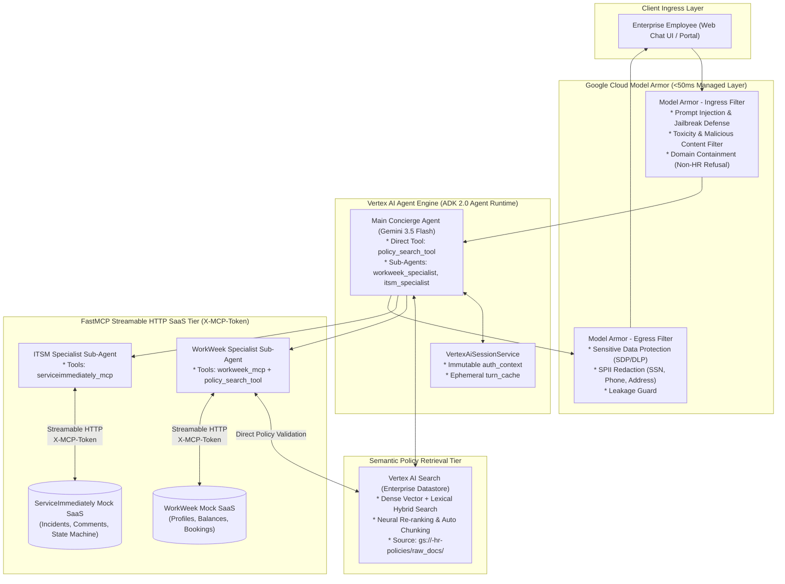

# System Architecture: Enterprise HR & IT Multi-Agent Assistant (Revision 5.0)

This document details the technical architecture for the **Enterprise HR & IT Multi-Agent Assistant** built on **Google Agent Development Kit (ADK 2.0)**, deployed on **Vertex AI Agent Engine (Agent Runtime)**, powered by **Vertex AI Search (Enterprise Datastore)**, and integrated with **WorkWeek** and **ServiceImmediately** via **FastMCP Streamable HTTP** using standard conversational sub-agents with autonomous specialist policy validation (**Option 2**).

---

## 1. System Topology Overview



---

## 2. Multi-Agent Delegation & Tool Access Pattern (Option 2)

```
+---------------------------------------------------------------------------------------------------------------+
|                                        AGENT DELEGATION TOPOLOGY                                              |
+---------------------------------------------------------------------------------------------------------------+
|                                                                                                               |
|                                       [Main Concierge Agent (Root)]                                           |
|                                             (Gemini 3.5 Flash)                                                |
|                                                      │                                                        |
|                   ┌──────────────────────────────────┼──────────────────────────────────┐                     |
|                   │ Direct Tool                      │ Conversational Delegation        │ Conversational      |
|                   ▼                                  ▼                                  ▼ Delegation          |
|        [policy_search_tool]                [workweek_specialist]                [itsm_specialist]             |
|    (Vertex AI Search Datastore)            (Standard Sub-Agent)                 (Standard Sub-Agent)          |
|                   ▲                                  │                                  │                     |
|                   │ Direct Policy Check              │                                  │                     |
|                   └──────────────────────────────────┤                                  │                     |
|                                                      ▼ Streamable HTTP                  ▼ Streamable HTTP     |
|                                            [WorkWeek FastMCP Server]        [ServiceImmediately FastMCP]      |
|                                             (/work-week/mcp/)                (/service-immediately/mcp/)      |
|                                                                                                               |
+---------------------------------------------------------------------------------------------------------------+
```

1. **`concierge_agent` (Root Orchestrator):**  
   Directly equipped with `policy_search_tool` (Vertex AI Search) to resolve general policy questions in a single turn. Automatically delegates interactive conversations to specialists via standard ADK routing (`sub_agents=[workweek_specialist, itsm_specialist]`).
2. **`workweek_specialist` (HCM Specialist Sub-Agent):**  
   Equipped with both `workweek_mcp` and `policy_search_tool`. Autonomously verifies policy constraints (e.g. Medical Certificate rules for $>2$ days sick leave) and executes bookings via FastMCP without parent routing overhead.
3. **`itsm_specialist` (ITSM Specialist Sub-Agent):**  
   Standard conversational sub-agent using native `McpToolset` connected to `/service-immediately/mcp/` with `X-MCP-Token`.

---

## 3. Key Design Decisions (Revision 5.0)

| Area | Decision | Rationale |
| :--- | :--- | :--- |
| **Specialist Policy Validation Workflow** | **Option 2: Autonomous Specialist Tool Access (`tools=[workweek_mcp, policy_search_tool]`)** | Eliminates 4–5 hop triangular ping-pong routing between parent and child, providing single-turn policy validation and execution with exact compliance reminders. |
| **Knowledge Retrieval** | **Vertex AI Search** (Enterprise Datastore) | Replaces manual OKF chunking with managed dense vector + lexical hybrid semantic search, neural re-ranking, and layout-aware document ingestion. |
| **Multi-Agent Mode** | **Standard Conversational Sub-Agents** | Uses native ADK conversation transfer (`sub_agents=[...]`) for a natural multi-agent dialogue without custom Pydantic task wrappers. |
| **Network Ingress** | **Direct to Agent Engine** (Removed Agent Gateway) | Eliminates extra proxy hop ($15\text{--}30\text{ms}$ latency savings) and leverages native IAM/OAuth2 endpoints on Vertex AI Agent Engine. |
| **Security Tier** | **Model Armor Only** (Removed Cloud Armor) | Focuses security on GenAI prompt sanitization, jailbreak prevention, and SPII masking (<50ms latency), removing redundant network WAF costs. |
| **MCP Connectivity** | **Native ADK `McpToolset`** | Connects statelessly over FastMCP Streamable HTTP with `X-MCP-Token` header, auto-discovering remote tool schemas with zero wrapper code. |
