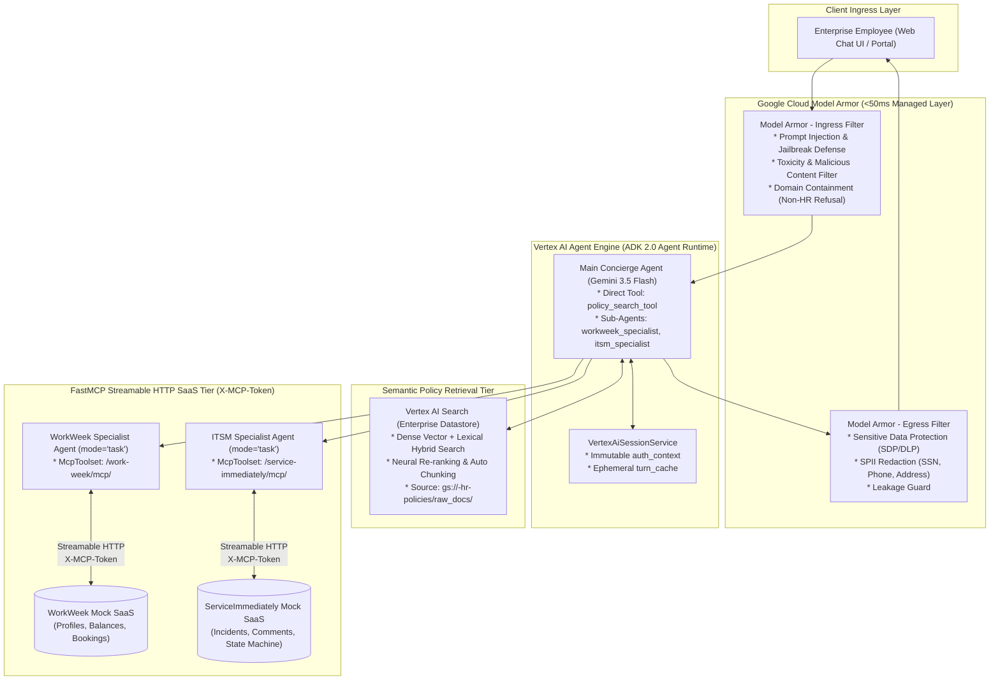

# System Architecture: Enterprise HR & IT Multi-Agent Assistant (Revision 4.0)

This document details the modernized technical architecture for the **Enterprise HR & IT Multi-Agent Assistant** built on **Google Agent Development Kit (ADK 2.0)**, deployed on **Vertex AI Agent Engine (Agent Runtime)**, powered by **Vertex AI Search (Enterprise Datastore)**, and integrated with **WorkWeek** and **ServiceImmediately** via **FastMCP Streamable HTTP**.

---

## 1. System Topology Overview



---

## 2. Multi-Agent Topology & Delegations

```
+---------------------------------------------------------------------------------------------------------------+
|                                        AGENT DELEGATION TOPOLOGY                                              |
+---------------------------------------------------------------------------------------------------------------+
|                                                                                                               |
|                                       [Main Concierge Agent (Root)]                                           |
|                                             (Gemini 3.5 Flash)                                                |
|                                                      │                                                        |
|                   ┌──────────────────────────────────┼──────────────────────────────────┐                     |
|                   │ Direct Tool                      │ Task Delegation                  │ Task Delegation     |
|                   ▼                                  ▼                                  ▼                     |
|        [policy_search_tool]                [workweek_specialist]                [itsm_specialist]             |
|    (Vertex AI Search Datastore)             (`mode="task"`)                      (`mode="task"`)              |
|                   │                                  │                                  │                     |
|                   │                                  ▼ Streamable HTTP                  ▼ Streamable HTTP     |
|                   │                        [WorkWeek FastMCP Server]        [ServiceImmediately FastMCP]      |
|                   │                         (/work-week/mcp/)                (/service-immediately/mcp/)      |
|                                                                                                               |
+---------------------------------------------------------------------------------------------------------------+
```

1. **`concierge_agent` (Root Orchestrator):**  
   Directly equipped with `policy_search_tool` (Vertex AI Search) to resolve policy questions in a single turn. Orchestrates multi-step workflows across specialists.
2. **`workweek_specialist` (HCM Specialist):**  
   Invoked in `mode="task"`, outputs typed `WorkWeekTaskOutput`. Uses native `McpToolset` connected to `/work-week/mcp/` with `X-MCP-Token`.
3. **`itsm_specialist` (ITSM Specialist):**  
   Invoked in `mode="task"`, outputs typed `ITSMTaskOutput`. Uses native `McpToolset` connected to `/service-immediately/mcp/` with `X-MCP-Token`.

---

## 3. Key Design Decisions (Revision 4.0)

| Area | Decision | Rationale |
| :--- | :--- | :--- |
| **Knowledge Retrieval** | **Vertex AI Search** (Enterprise Datastore) | Replaces manual OKF chunking with managed dense vector + lexical hybrid semantic search, neural re-ranking, and layout-aware document ingestion. |
| **Network Ingress** | **Direct to Agent Engine** (Removed Agent Gateway) | Eliminates extra proxy hop ($15\text{--}30\text{ms}$ latency savings) and leverages native IAM/OAuth2 endpoints on Vertex AI Agent Engine. |
| **Security Tier** | **Model Armor Only** (Removed Cloud Armor) | Focuses security on GenAI prompt sanitization, jailbreak prevention, and SPII masking (<50ms latency), removing redundant network WAF costs. |
| **MCP Connectivity** | **Native ADK `McpToolset`** | Connects statelessly over FastMCP Streamable HTTP with `X-MCP-Token` header, auto-discovering remote tool schemas with zero wrapper code. |
