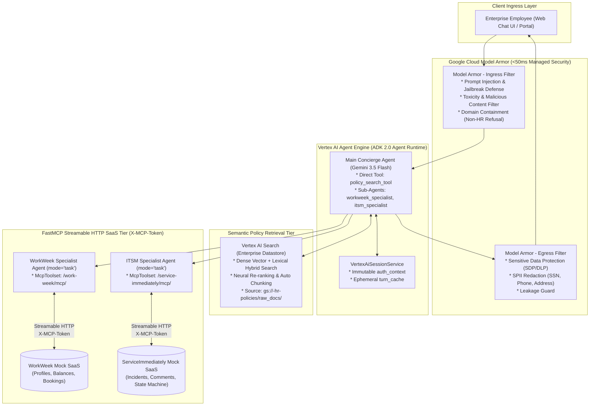
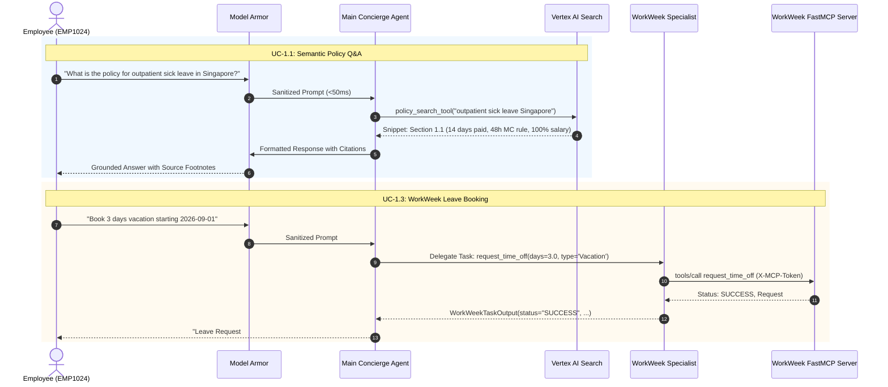
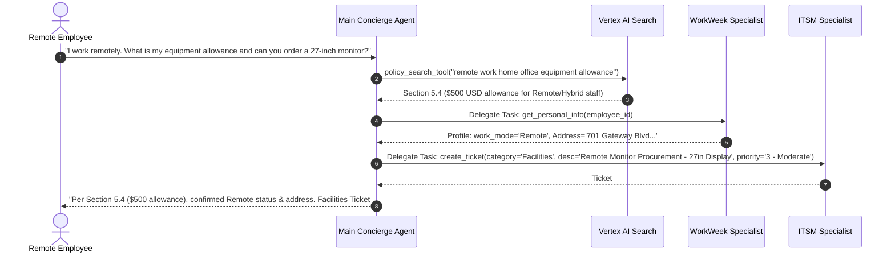
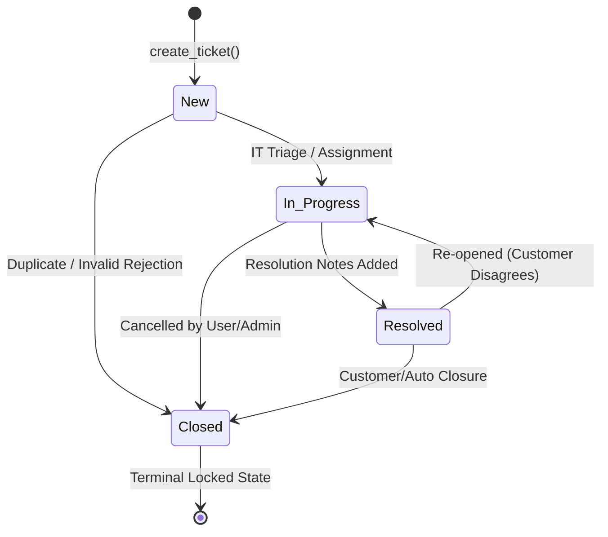

# MVP SOLUTION DESIGN DOCUMENT
# Enterprise HR Multi-Agent Assistant

---

## Document Control

### Document Metadata
| Field | Value |
| :--- | :--- |
| **Document Title** | Solution Design Document (SDD) – Enterprise HR Multi-Agent Application |
| **Project Name** | HR Agentic Solution (MVP 1) |
| **Author(s)** | Enterprise AI Solution Architecture & Engineering Team |
| **Creation Date** | August 27, 2026 |
| **Document Status** | Approved / Baseline (Revision 4.0) |
| **Target Audience** | Enterprise HR Leadership, IT Operations, Cloud Solutions Architects, Software Engineers, InfoSec / Compliance Officers |
| **Classification** | Internal / Confidential |

### Revision History
| Version | Date | Author | Description of Change |
| :--- | :--- | :--- | :--- |
| 0.1 | 2026-08-27 | AI Solution Architect | Initial outline setup and architecture draft |
| 1.0 | 2026-08-27 | AI Solution Architect | Full MVP 1 design with ADK multi-agent orchestration, FastMCP integrations, and evaluation framework |
| 2.0 | 2026-08-27 | AI Solution Architect | ADK 2.0 compliance, full FastMCP capabilities, and formalized ITSM state machine matrix |
| 3.0 | 2026-08-27 | AI Solution Architect | Open Knowledge Format (OKF) initial design |
| 3.1 | 2026-08-27 | AI Solution Architect | GCS knowledge backing and session memoization |
| **4.0** | **2026-08-27** | **AI Solution Architect** | **Architecture Modernization & Streamlining:**<br>1. **Semantic Search via Vertex AI Search:** Replaced OKF with Google Cloud Vertex AI Search (Enterprise Datastore on GCS) for neural semantic retrieval, hybrid lexical ranking, and automatic layout parsing.<br>2. **Streamlined Ingress (Removed Agent Gateway & Cloud Armor):** Direct client connection to Vertex AI Agent Engine via standard IAM/OAuth2, eliminating gateway latency hops and redundant Load Balancer WAF costs.<br>3. **Main Agent Orchestration Topology:** Main Concierge Agent directly equipped with `policy_search_tool` for 1-turn policy Q&A, and sub-delegating to `workweek_specialist` and `itsm_specialist` (`mode="task"`).<br>4. **Native FastMCP `McpToolset` Integration:** Specialists directly wire `McpToolset` over Streamable HTTP with `X-MCP-Token` header.<br>5. **Dedicated Model Armor Security:** Enforces LLM prompt sanitization, domain containment, and SDP/DLP SPII masking. |

---

## 1. Executive Summary & Scope Boundaries

### 1.1. Business Overview & Context
Enterprise employees navigate a fragmented ecosystem of human resources and IT service portals. Routine inquiries—such as checking PTO balances, understanding bereavement or parental leave policies, updating contact information, or opening IT helpdesk incident tickets—require navigating complex SaaS user interfaces across systems like **WorkWeek** (Human Capital Management) and **ServiceImmediately** (IT Service Management).

**Key Pain Points:**
- **High Tier-1 Support Volume:** HR and IT helpdesks spend over 40% of operational bandwidth fielding repetitive status inquiries, basic policy clarifications, and routine profile tasks.
- **Friction in Cross-System Workflows:** High-frequency employee lifecycles (remote work equipment requests, medical leave of absence, regional office relocations) require manual, unlinked actions across multiple SaaS portals.
- **Context Fragmentation & Compliance Risk:** Lack of centralized policy grounding leads to inconsistent interpretations, while manual data entry risks unauthorized exposure of Sensitive Personally Identifiable Information (SPII).

**High-Level Business Goals:**
- **Deflect Tier-1 Inquiries:** Automate routine HR and IT inquiries to deflect at least 40% of tier-1 support volume within the first 6 months.
- **Streamline Self-Service Transactions:** Provide a unified, natural-language conversational interface that enables zero-friction execution of transactional tasks (leave booking, ticket tracking, contact updates).
- **Validate Multi-Agent Orchestration:** Prove the multi-agent chaining paradigm across unstructured semantic policy knowledge (Vertex AI Search) and structured transactional APIs (WorkWeek, ServiceImmediately) with 100% transactional correctness.
- **Enforce Zero-Trust Enterprise AI Governance:** Guarantee zero data leaks and zero cross-user profile access via managed **Google Cloud Model Armor** inspection, strict identity propagation, and comprehensive auditability.

---

### 1.2. Scope Boundaries

```
+---------------------------------------------------------------------------------------+
|                                    SYSTEM BOUNDARIES                                  |
+---------------------------------------------------+-----------------------------------+
|                  IN SCOPE (MVP 1)                 |            OUT OF SCOPE           |
+---------------------------------------------------+-----------------------------------+
| * Web-based Conversational UI (Chat Interface)    | * Multi-lingual NLP processing    |
| * Semantic Policy Q&A via Vertex AI Search        | * Voice / Multimodal interactions |
| * WorkWeek HCM: Profile, Balances, Leave Requests | * Payroll, Compensation, & Bonus  |
| * ServiceImmediately ITSM: Incident Lifecycle     | * Performance Reviews & Appraisal |
| * Cross-System Orchestration (UC-2.1, 2.2, 2.3)   | * Integrations outside WorkWeek,  |
| * FastMCP Streamable HTTP Integration Layer       |   ServiceImmediately & Policy KB  |
| * ADK 2.0 Multi-Agent Framework & Graph Workflows | * Multi-Tenant SaaS Partitioning  |
| * Managed Deployment on Vertex AI Agent Engine    | * Enterprise SSO / Okta / Entra   |
| * Model Armor Safety Scanning (<50ms overhead)    |   (Mock PAT authentication used)  |
| * Turn-Scoped Ephemeral Memoization               |                                   |
+---------------------------------------------------+-----------------------------------+
```

---

### 1.3. Target Architecture Overview

The system employs a streamlined Multi-Agent Architecture built on the **Google Agent Development Kit (ADK 2.0)** and deployed directly on **Vertex AI Agent Engine (Agent Runtime)**, protected by **Google Cloud Model Armor**. Policy knowledge is powered by **Vertex AI Search (Enterprise Datastore)**.



---

## 2. Multi-Agent System Architecture & ADK 2.0 Design

### 2.1. Agent Role Decomposition & Tool Mapping

The architecture employs **1 Root Concierge Agent** and **2 Specialized Sub-Agents** using ADK 2.0 typed task delegation:

```
+---------------------------------------------------------------------------------------------------------------+
|                                        AGENT DELEGATION TOPOLOGY                                              |
+---------------------------------------------------------------------------------------------------------------+
|                                                                                                               |
|                                       [Main Concierge Agent (Root)]                                           |
|                                             (Gemini 3.5 Flash)                                                |
|                                                      │                                                        |
|                   ┌──────────────────────────────────┼──────────────────────────────────┐                     |
|                   │ Direct Tool                      │ Task Delegation                  │ Task Delegation     |
|                   ▼                                  ▼                                  ▼                     |
|        [policy_search_tool]                [workweek_specialist]                [itsm_specialist]             |
|    (Vertex AI Search Datastore)             (`mode="task"`)                      (`mode="task"`)              |
|                   │                                  │                                  │                     |
|                   │                                  ▼ Streamable HTTP                  ▼ Streamable HTTP     |
|                   │                        [WorkWeek FastMCP Server]        [ServiceImmediately FastMCP]      |
|                   │                         (/work-week/mcp/)                (/service-immediately/mcp/)      |
|                                                                                                               |
+---------------------------------------------------------------------------------------------------------------+
```

| Agent Name | Role & Scope | Invocation Mode | Tools Assigned | Output Schema |
| :--- | :--- | :--- | :--- | :--- |
| **`concierge_agent`** | Primary Router, Orchestrator, and Policy Advisor | Interactive Root | `policy_search_tool` | Unstructured Conversational Text with Citations |
| **`workweek_specialist`** | HCM Specialist (Profile, Balances, Time-Off) | `mode="task"` | `workweek_mcp` (`McpToolset`) | `WorkWeekTaskOutput` (Pydantic Model) |
| **`itsm_specialist`** | ITSM Service Desk Specialist (Incidents, Status) | `mode="task"` | `serviceimmediately_mcp` (`McpToolset`) | `ITSMTaskOutput` (Pydantic Model) |

---

### 2.2. Native FastMCP Toolset Definition & Integration

All SaaS interactions use native ADK 2.0 `McpToolset` over **FastMCP Streamable HTTP** with `X-MCP-Token` header authentication:

```python
from google.adk.agents import Agent
from google.adk.tools.mcp_tool import McpToolset
from google.adk.tools.mcp_tool.mcp_session_manager import StreamableHTTPConnectionParams

from agent.config import (
    MODEL_NAME,
    WORKWEEK_MCP_URL,
    SERVICEIMMEDIATELY_MCP_URL,
    MCP_TOKEN
)
from agent.schemas import WorkWeekTaskOutput, ITSMTaskOutput
from agent.tools.search_tool import policy_search_tool
from agent.prompt import (
    CONCIERGE_INSTRUCTION,
    WORKWEEK_SPECIALIST_INSTRUCTION,
    ITSM_SPECIALIST_INSTRUCTION
)

# 1. Native FastMCP Toolset: WorkWeek HCM
workweek_mcp = McpToolset(
    connection_params=StreamableHTTPConnectionParams(
        url=WORKWEEK_MCP_URL,
        headers={"X-MCP-Token": MCP_TOKEN}
    )
)

# 2. Native FastMCP Toolset: ServiceImmediately ITSM
serviceimmediately_mcp = McpToolset(
    connection_params=StreamableHTTPConnectionParams(
        url=SERVICEIMMEDIATELY_MCP_URL,
        headers={"X-MCP-Token": MCP_TOKEN}
    )
)

# 3. Specialist Agent: WorkWeek (mode='task')
workweek_specialist = Agent(
    name="workweek_specialist",
    model=MODEL_NAME,
    mode="task",
    output_schema=WorkWeekTaskOutput,
    description="Handles WorkWeek HCM operations: employee profile lookups, contact updates, leave balances, and leave bookings.",
    instruction=WORKWEEK_SPECIALIST_INSTRUCTION,
    tools=[workweek_mcp],
)

# 4. Specialist Agent: ITSM (mode='task')
itsm_specialist = Agent(
    name="itsm_specialist",
    model=MODEL_NAME,
    mode="task",
    output_schema=ITSMTaskOutput,
    description="Handles ServiceImmediately ITSM operations: ticket queries, incident creation, comments, and status transitions.",
    instruction=ITSM_SPECIALIST_INSTRUCTION,
    tools=[serviceimmediately_mcp],
)

# 5. Main Concierge Agent (Root)
concierge_agent = Agent(
    name="concierge_agent",
    model=MODEL_NAME,
    description="Primary Enterprise HR & IT Concierge Assistant orchestrating policy search, WorkWeek HCM, and ITSM service desk operations.",
    instruction=CONCIERGE_INSTRUCTION,
    tools=[policy_search_tool],
    sub_agents=[workweek_specialist, itsm_specialist],
)
```

---

## 3. Semantic Policy Retrieval Tier: Vertex AI Search

### 3.1. Vertex AI Search Architecture
To deliver natural-language semantic retrieval across corporate policies, the system integrates **Vertex AI Search (Enterprise Datastore)**:

* **Authoritative Source Store:** Policy documents (PDF, DOCX, Markdown, HTML) are synced to `gs://<project>-hr-policies/raw_docs/`.
* **Automatic Layout-Aware Chunking:** Vertex AI Search parses complex document structures (tables, headings, lists) preserving semantic integrity without manual chunk slicing.
* **Hybrid Search Engine:** Combines dense neural embeddings (`text-embedding-005`) with lexical BM25 matching and Google's production neural re-ranking.
* **Extractive Answer & Snippet Attribution:** Returns direct answer text, verbatim snippet chunks, document titles, and source URLs for exact citation footnotes.

### 3.2. `policy_search_tool` Tool Contract
```python
from google.adk.tools import FunctionTool
from google.cloud import discoveryengine_v1 as discoveryengine

def search_hr_policies(query: str, region_filter: str = "Singapore") -> list[dict]:
    """
    Performs semantic hybrid search across enterprise policy documents in Vertex AI Search.
    
    Args:
        query: Natural-language policy question or keywords.
        region_filter: Target jurisdiction for policy applicability (default: 'Singapore').
    Returns:
        List of matching policy segments with extractive snippets, document titles, and source links.
    """
    # Invokes Vertex AI Search Datastore Client API
    ...
```

---

## 4. End-to-End Core Use Cases

### 4.1. Single-Domain Scenarios (Tier-1 Deflection)



---

### 4.2. Cross-System Orchestration Scenarios

#### UC-2.1: Remote Work Equipment Order


---

## 5. Security, Identity & Zero-Trust Governance

```
+---------------------------------------------------------------------------------------------------------------+
|                                    ZERO-TRUST AI SECURITY ARCHITECTURE                                        |
+---------------------------------------------------------------------------------------------------------------+
|                                                                                                               |
|  [Caller / Client]                                                                                            |
|         │                                                                                                     |
|         ▼ Ingress (<50ms)                                                                                     |
|  [Google Cloud Model Armor]                                                                                   |
|    ├── Prompt Injection & Jailbreak Defense (Neural Classifier)                                               |
|    ├── Malicious Content & Toxic Prompt Filter                                                                |
|    └── Domain Containment Filter (Rejects non-HR programming / unrelated queries)                             |
|         │                                                                                                     |
|         ▼ Sanitized Ingress                                                                                   |
|  [Vertex AI Agent Engine]                                                                                     |
|    ├── Immutable Identity Anchor (`ctx.state["auth_context"]`) ➔ Prevents parameter spoofing                 |
|    ├── Ephemeral Request Memoization (`ctx.state["turn_cache"]`) ➔ Eliminates redundant SaaS calls             |
|    └── FastMCP Outbound Layer ➔ Transmits `X-MCP-Token` header                                               |
|         │                                                                                                     |
|         ▼ Egress (<20ms)                                                                                      |
|  [Model Armor Response Inspection]                                                                            |
|    ├── Sensitive Data Protection (SDP/DLP) SPII Redaction (SSN, Phone, Address, Credit Cards)                 |
|    └── Hallucination & Grounding Verification Guardrail                                                       |
|                                                                                                               |
+---------------------------------------------------------------------------------------------------------------+
```

### 5.1. Security Architecture Evaluation: Model Armor vs. Cloud Armor
* **Model Armor (Retained - Core AI Security):** Operates at Layer 7 GenAI application level to sanitize prompts, enforce domain containment, and redact SPII with sub-50ms latency.
* **Cloud Armor (Removed - Redundant):** Cloud Armor (L3/L4/L7 Network WAF) is omitted because the agent service is deployed internally on Vertex AI Agent Engine with authenticated IAM/OAuth sessions, eliminating unnecessary Load Balancer infrastructure costs.

---

## 6. ServiceImmediately Formal State Machine Matrix

To prevent invalid incident lifecycles, the ITSM Specialist enforces the following strict transition matrix:



| Source State | Target: `New` | Target: `In Progress` | Target: `Resolved` | Target: `Closed` |
| :--- | :---: | :---: | :---: | :---: |
| **`New`** | — | ✅ Permitted | ❌ Blocked | ✅ Permitted |
| **`In Progress`** | ❌ Blocked | — | ✅ Permitted | ✅ Permitted |
| **`Resolved`** | ❌ Blocked | ✅ Permitted | — | ✅ Permitted |
| **`Closed`** | ❌ Blocked | ❌ Blocked | ❌ Blocked | — (Terminal) |

---

## 7. Automated Evaluation & Quality Flywheel (ADK Eval)

### 7.1. Golden Benchmark Suite (`evals/datasets/benchmark_golden_cases.json`)
The test harness includes 11 golden benchmark test cases across:
1. **Policy Semantic Q&A (Vertex AI Search Grounding)**
2. **WorkWeek Profile & Leave Balance Queries**
3. **Guardrail Enforcements (Insufficient balances, chronological dates)**
4. **ITSM Ticket Lifecycles & 5-Min Duplicate Rejections**
5. **Cross-System Multi-Agent Chaining (UC-2.1, 2.2, 2.3)**
6. **Safety & Domain Containment Refusals (Model Armor)**

### 7.2. Automated Evaluation Execution
```bash
python evals/run_eval.py
```
Outputs precision, tool call accuracy, semantic grounding score, and latency benchmarks.
