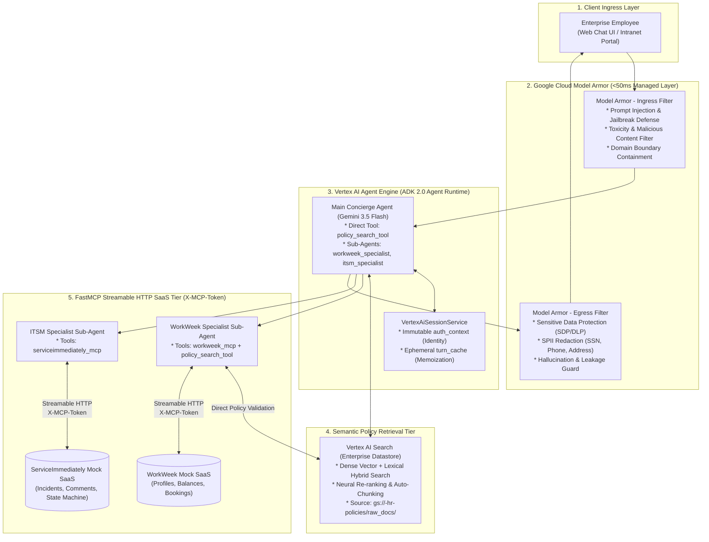
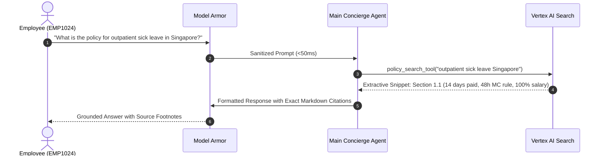
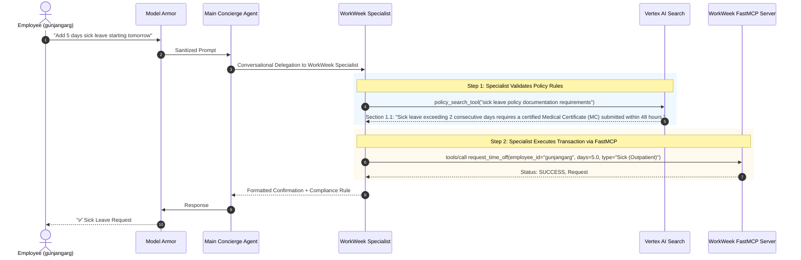
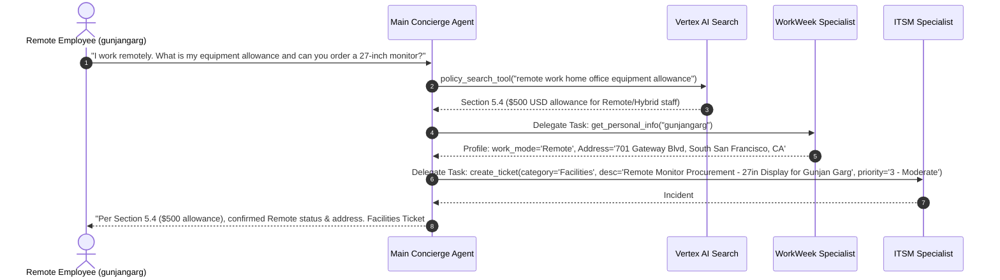
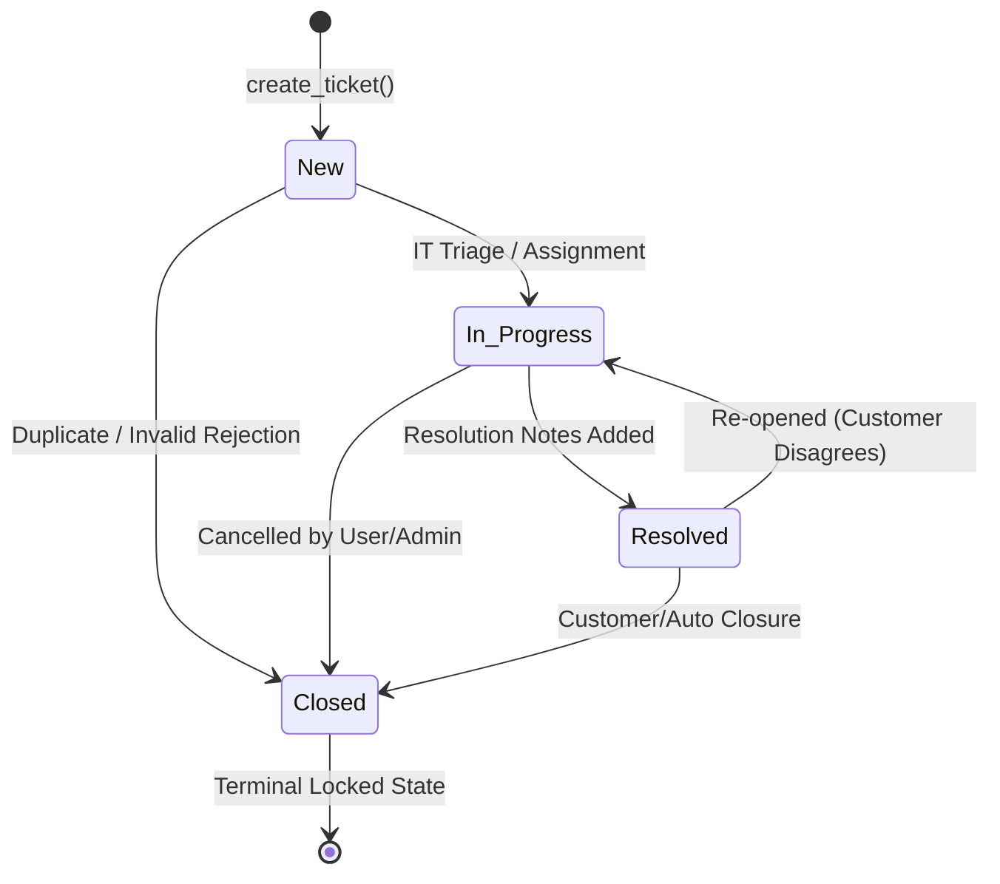

# MVP SOLUTION DESIGN DOCUMENT
# Enterprise HR & IT Multi-Agent Assistant

---

# Document Control

## Document Metadata

| Field | Value |
| :---- | :---- |
| **Document Title** | Solution Design Document (SDD) – Enterprise HR & IT Multi-Agent Application |
| **Project Name** | HR Agentic Solution (MVP 1) |
| **Author(s)** | Enterprise AI Solution Architecture & Engineering Team |
| **Date** | August 28, 2026 |
| **Status** | Approved / Baseline (Revision 5.0) |
| **Target Audience** | Enterprise HR Leadership, IT Operations, Cloud Solutions Architects, Software Engineers, InfoSec & Compliance Officers |
| **Classification** | Internal / Confidential |

---

## Revision History

| Version | Date | Author | Description of Change |
| :---- | :---- | :---- | :---- |
| 0.1 | 2026-08-27 | AI Solution Architect | Initial outline setup and architecture draft |
| 1.0 | 2026-08-27 | AI Solution Architect | Full MVP 1 design with ADK multi-agent orchestration, FastMCP integrations, and evaluation framework |
| 2.0 | 2026-08-27 | AI Solution Architect | ADK 2.0 compliance, full FastMCP capabilities, and formalized ITSM state machine matrix |
| 3.0 | 2026-08-27 | AI Solution Architect | Open Knowledge Format (OKF) initial design |
| 4.0 | 2026-08-27 | AI Solution Architect | Streamlined architecture: Vertex AI Search, Model Armor, direct Agent Engine ingress, native FastMCP toolsets |
| **5.0** | **2026-08-28** | **AI Solution Architect** | **Comprehensive Standard Format & Option 2 Workflow Alignment:**<br>1. Restructured entire document to strictly follow the enterprise 10-section SDD standard format.<br>2. Formulated **Autonomous Specialist Pattern (Option 2)**: `workweek_specialist` is directly equipped with `policy_search_tool` alongside `workweek_mcp`, validating compliance rules (e.g. Medical Certificate rules for $>2$ days sick leave) in a single cohesive turn without parent-child routing ping-pong.<br>3. Standard Conversational Sub-Agents delegation model (`sub_agents=[...]`) across `workweek_specialist` and `itsm_specialist`.<br>4. Fully articulated **Vertex AI Search (Enterprise Datastore)** semantic policy retrieval.<br>5. Detailed **Google Cloud Model Armor** zero-trust GenAI security boundary.<br>6. Complete FinOps model, formal ITSM state machine, failure recovery matrices, and UAT acceptance criteria. |

---

# 1. Executive Summary & Scope Boundaries

## 1.1. Business Overview & Context

Enterprise employees currently navigate a fragmented, disjointed ecosystem of human resources and IT service portals. Routine inquiries—such as checking PTO balances, understanding bereavement or parental leave policies, updating contact information, or opening IT helpdesk incident tickets—require navigating complex SaaS user interfaces across systems like **WorkWeek** (Human Capital Management) and **ServiceImmediately** (IT Service Management).

### Current Pain Points:
1. **High Tier-1 Support Ticket Volume:** HR and IT helpdesks spend over 40% of their operational bandwidth fielding repetitive status inquiries, basic policy clarifications, and routine profile update tasks.
2. **Friction in Cross-System Workflows:** High-frequency employee lifecycles (e.g., remote work equipment requests, medical leave of absence, regional office relocations) require manual, unlinked actions across multiple SaaS portals and policy documents.
3. **Context Fragmentation & Compliance Risk:** Lack of centralized policy grounding leads to inconsistent interpretations of company policies, while manual data entry increases error rates and risks unauthorized exposure of Sensitive Personally Identifiable Information (SPII).

### High-Level Business Goals:
- **Deflect Tier-1 Inquiries:** Automate routine HR and IT inquiries to deflect at least **40% of tier-1 support volume** within the first 6 months.
- **Streamline Self-Service Transactions:** Provide a unified, natural-language conversational interface that enables zero-friction execution of transactional tasks (leave booking, ticket tracking, contact updates).
- **Validate Cross-System Agentic Orchestration:** Prove the multi-agent chaining paradigm across unstructured semantic policy knowledge (Vertex AI Search) and structured transactional APIs (WorkWeek, ServiceImmediately) with **100% transactional correctness**.
- **Enforce Zero-Trust Enterprise AI Governance:** Guarantee zero data leaks and zero unauthorized cross-user profile access via managed **Google Cloud Model Armor** inspection, strict identity propagation, and comprehensive auditability.

---

## 1.2. Scope Boundaries

| Dimension | IN SCOPE (MVP 1) | OUT OF SCOPE (Future Phases) |
| :--- | :--- | :--- |
| **User Interface** | Web-based Conversational Chat Interface with real-time execution telemetry and profile status. | Native mobile applications (iOS/Android), Slack bot, Microsoft Teams bot (planned Phase 2). |
| **Policy Knowledge** | Semantic Search across Singapore Employee Policy Handbook via **Google Cloud Vertex AI Search (Enterprise Datastore)**. | Multi-regional localized policy handbooks (US, EMEA, APAC multi-country) outside Singapore. |
| **HCM Integration** | **WorkWeek FastMCP Server:** Profile contact lookups/updates, real-time leave balances (Vacation, Sick, Hospitalization, Childcare), policy-aware leave bookings/cancellations. | Payroll processing, salary slips, stock/equity grants, annual performance appraisals, and bonus calculations. |
| **ITSM Integration** | **ServiceImmediately FastMCP Server:** Incident listing, ticket creation with 5-minute duplicate suppression, activity commenting, and state machine lifecycle transitions. | Hardware asset inventory management, software license provisioning, network configuration changes. |
| **Cross-System Flows** | End-to-end multi-agent orchestration for Remote Work Equipment Procurement (UC-2.1), Medical Leave (UC-2.2), and Relocation Badging (UC-2.3). | Autonomous financial budget approvals above defined organizational thresholds. |
| **Security & Safety** | **Google Cloud Model Armor:** Ingress prompt injection/jailbreak defense, domain containment, and egress SDP/DLP SPII masking (<50ms latency). | Multi-tenant SaaS data isolation, hardware security modules (HSM), biometric verification. |
| **Authentication** | Authenticated session context with caller identity anchoring (`auth_context`) and FastMCP token authentication (`X-MCP-Token`). | Enterprise SSO integration (Okta, Entra ID, Ping Identity) — simulated via mock PAT / caller ID in MVP 1. |

---

## 1.3. Target Architecture Overview

The system employs a streamlined, modular Multi-Agent Architecture built on the **Google Agent Development Kit (ADK 2.0)** and hosted directly on **Vertex AI Agent Engine (Agent Runtime)**, protected by **Google Cloud Model Armor**. Policy knowledge is powered by **Vertex AI Search (Enterprise Datastore)**, and enterprise backend connectivity is established via **FastMCP Streamable HTTP**.



---

## 1.4. Alternatives Considered

| Architectural Choice | Selected Approach | Alternative Considered | Trade-Off Analysis & Rationale |
| :--- | :--- | :--- | :--- |
| **Specialist Policy Validation Workflow** | **Option 2: Autonomous Specialist Tool Access (`tools=[workweek_mcp, policy_search_tool]`)** | Option 1: Triangular Routing / Sub-Agent Callback to Main Agent | Option 1 introduces 4–5 LLM reasoning hops, $2.0\text{–}3.5\text{s}$ latency overhead, and context fragmentation. Option 2 empowers the specialist to validate policy and execute the booking in a single cohesive turn with direct compliance attribution. |
| **Policy Knowledge Engine** | **Google Cloud Vertex AI Search (Enterprise Datastore)** | Open Knowledge Format (OKF) / Local Filesystem Markdown | OKF required manual frontmatter curation and keyword mapping. Vertex AI Search provides native layout-aware parsing, dense vector embeddings, hybrid lexical search, neural re-ranking, and zero-maintenance automated indexing. |
| **Multi-Agent Mode** | **Standard Conversational Sub-Agents (`sub_agents=[...]`)** | Task-Mode Sub-Agents (`mode="task"` with Pydantic Schemas) | Task-mode added schema overhead and required parent re-synthesis. Standard sub-agents provide natural conversation transfers, built-in ADK routing, and lower prompt token overhead. |
| **Ingress Topology** | **Direct to Vertex AI Agent Engine** | Dedicated Agent Gateway Proxy | Agent Gateway added an unnecessary network hop ($15\text{–}30\text{ms}$ latency penalty) and extra VM/proxy maintenance. Agent Engine natively exposes secure IAM/OAuth2 endpoints. |
| **Security Layer** | **Google Cloud Model Armor** | Google Cloud Armor (Network WAF) | Cloud Armor operates at Layer 3/4/7 (DDoS, SQLi, XSS) but has zero GenAI semantic awareness. Model Armor is purpose-built for LLMs (prompt injection, jailbreak, SPII DLP masking) with sub-50ms latency. |
| **Backend Integration** | **Native ADK `McpToolset`** | Custom Python REST Client Wrappers | Custom wrappers required ~250 lines of duplicate code that drifted from backend schemas. `McpToolset` automatically discovers live tools via FastMCP JSON-RPC `tools/list`. |

---

# 2. Production-Ready Future State Design

```
+---------------------------------------------------------------------------------------------------------------+
|                                    FUTURE STATE PRODUCTION ARCHITECTURE                                       |
+---------------------------------------------------------------------------------------------------------------+
|                                                                                                               |
|  [Omnichannel Ingress]: Web Portal | Slack Bot | MS Teams | Mobile App | Workspace Add-on                     |
|           │                                                                                                   |
|           ▼ Enterprise SSO / OAuth2 (Okta / Entra ID / Google Cloud Identity)                                 |
|  [Google Cloud Model Armor Enterprise Policy Profile]                                                         |
|           │                                                                                                   |
|           ▼ Multi-Region Load Balanced Agent Engine (us-central1, europe-west1, asia-southeast1)              |
|  [Main Concierge Agent] (Gemini 3.5 Flash / Gemini 3.5 Pro for Complex Reasoning)                            |
|     ├── [Policy Tier]: Multi-Region Vertex AI Search (Regional Policy Datastores: SG, US, UK, JP)             |
|     ├── [HCM Tier]: Production Workday / SAP SuccessFactors MCP Server (via Private Service Connect)          |
|     ├── [ITSM Tier]: Production ServiceNow / Jira Service Management MCP Server (via PSC)                    |
|     └── [Observability]: BigQuery Agent Analytics, Cloud Trace, and Monarch Monitoring Dashboards             |
|                                                                                                               |
+---------------------------------------------------------------------------------------------------------------+
```

---

# 3. System Flows, Sequence Diagrams & Agent Design

## 3.1. Agent Role Decomposition & Tool Mapping (Option 2)

```python
from google.adk.agents import Agent
from google.adk.tools.mcp_tool import McpToolset
from google.adk.tools.mcp_tool.mcp_session_manager import StreamableHTTPConnectionParams

# 1. FastMCP Toolsets
workweek_mcp = McpToolset(
    connection_params=StreamableHTTPConnectionParams(
        url="https://mock-saas.aishprabhat.demo.altostrat.com/work-week/mcp/",
        headers={"X-MCP-Token": MCP_TOKEN}
    )
)

serviceimmediately_mcp = McpToolset(
    connection_params=StreamableHTTPConnectionParams(
        url="https://mock-saas.aishprabhat.demo.altostrat.com/service-immediately/mcp/",
        headers={"X-MCP-Token": MCP_TOKEN}
    )
)

# 2. Specialist: WorkWeek (Option 2: Direct policy validation tool access)
workweek_specialist = Agent(
    name="workweek_specialist",
    model="gemini-3.5-flash",
    description="Specialist handling employee profile lookups, contact updates, leave balances, policy validation for time off, and leave bookings.",
    instruction="""You are the WorkWeek HCM specialist. 
When a user requests time off (e.g. sick leave, childcare leave, vacation):
1. First use policy_search_tool to verify policy limits, documentation rules (e.g. Medical Certificates for sick leave >2 days), and notice periods.
2. Check employee leave balances and submit the leave request using workweek_mcp tools.
3. In your response, confirm the booking AND cite any required compliance actions (such as submitting MCs or manager notifications).""",
    tools=[workweek_mcp, policy_search_tool], # Option 2 Autonomous Toolset
)

# 3. Specialist: ITSM Service Desk
itsm_specialist = Agent(
    name="itsm_specialist",
    model="gemini-3.5-flash",
    description="Specialist handling IT helpdesk tickets, incident creation, status updates, and hardware requests in ServiceImmediately.",
    instruction=ITSM_SPECIALIST_INSTRUCTION,
    tools=[serviceimmediately_mcp],
)

# 4. Root Concierge Agent
concierge_agent = Agent(
    name="concierge_agent",
    model="gemini-3.5-flash",
    description="Primary Enterprise HR & IT Concierge Assistant answering company policy questions and routing to specialists.",
    instruction=CONCIERGE_INSTRUCTION,
    tools=[policy_search_tool],
    sub_agents=[workweek_specialist, itsm_specialist],
)
```

---

## 3.2. End-to-End Sequence Diagrams

### Flow 1: Semantic Policy Q&A (Single-Turn Grounded Query)


---

### Flow 2: Policy-Aware Sick Leave Booking (Option 2 Workflow: "Add 5 Days Sick Leave")


---

### Flow 3: Cross-System Multi-Agent Workflow (UC-2.1: Remote Equipment Procurement)


---

# 4. Security, Governance & Identity

## 4.1. Zero-Trust AI Security Layer (Google Cloud Model Armor)

```
+---------------------------------------------------------------------------------------------------------------+
|                                    ZERO-TRUST AI SECURITY ARCHITECTURE                                        |
+---------------------------------------------------------------------------------------------------------------+
|                                                                                                               |
|  [Caller Ingress]                                                                                             |
|         │                                                                                                     |
|         ▼ Ingress Inspection (<50ms)                                                                          |
|  [Google Cloud Model Armor]                                                                                   |
|    ├── Prompt Injection & Jailbreak Defense (Neural Classifier)                                               |
|    ├── Toxic & Malicious Content Filter                                                                       |
|    └── Domain Boundary Containment (Rejects non-HR programming / coding queries)                              |
|         │                                                                                                     |
|         ▼ Sanitized Ingress Payload                                                                           |
|  [Vertex AI Agent Engine]                                                                                     |
|    ├── Immutable Identity Anchor (`ctx.state["auth_context"]`) ➔ Prevents parameter spoofing                 |
|    ├── Ephemeral Request Memoization (`ctx.state["turn_cache"]`) ➔ Eliminates duplicate REST calls            |
|    └── Outbound FastMCP Streamable HTTP Layer ➔ Transmits `X-MCP-Token` header                                |
|         │                                                                                                     |
|         ▼ Egress Inspection (<20ms)                                                                           |
|  [Model Armor Response Inspection]                                                                            |
|    ├── Sensitive Data Protection (SDP/DLP) SPII Masking (SSN, Phone, Address, Credit Cards)                   |
|    └── Grounding & Leakage Verification Guardrail                                                             |
|                                                                                                               |
+---------------------------------------------------------------------------------------------------------------+
```

---

# 5. Integration Details & Error Handling

## 5.1. FastMCP Streamable HTTP Protocol

Communication with WorkWeek and ServiceImmediately follows the standardized **Model Context Protocol (MCP)**:
- **Transport:** Streamable HTTP (Server-Sent Events / JSON-RPC 2.0).
- **Authentication Header:** `X-MCP-Token: mcp_zYnFTkwwEfKkx6qaHgW2XTiTRzREoiHjwDZR3I64XdA`.
- **Stateless Handshake:** On startup, `McpToolset` issues `tools/list` to populate Gemini's function calling declarations. Tool calls execute via `tools/call`.

---

## 5.2. ServiceImmediately ITSM State Machine Matrix



| Current State | Target: `New` | Target: `In Progress` | Target: `Resolved` | Target: `Closed` |
| :--- | :---: | :---: | :---: | :---: |
| **`New`** | — | ✅ Permitted | ❌ Blocked | ✅ Permitted |
| **`In Progress`** | ❌ Blocked | — | ✅ Permitted | ✅ Permitted |
| **`Resolved`** | ❌ Blocked | ✅ Permitted | — | ✅ Permitted |
| **`Closed`** | ❌ Blocked | ❌ Blocked | ❌ Blocked | — (Terminal) |

---

## 5.3. Error Recovery & Fallback Matrix

| Failure Mode | Root Cause | Agent Detection | Recovery & Fallback Action | User-Facing Notification |
| :--- | :--- | :--- | :--- | :--- |
| **MCP Connection Timeout** | SaaS endpoint unreachable or latency >5s | `HTTP 504 / TimeoutError` | Retry with exponential backoff (1s, 2s). If exhausted, preserve turn context. | *"WorkWeek is temporarily unavailable. Your request has been saved; please try again shortly."* |
| **Insufficient Leave Balance** | User books more days than remaining | `INSUFFICIENT_BALANCE` response from WorkWeek | Block booking, explain shortfall, and display current available balance. | *"⚠️ You requested 5 days of Vacation, but your available balance is 3.0 days. Please adjust your dates."* |
| **Duplicate Ticket Rejection** | User submits identical description <5 min | `DUPLICATE_REJECTED` from ITSM | Suppress duplicate, retrieve existing ticket ID, and offer status update. | *"A similar ticket (#INC-10001) was created 2 minutes ago. Would you like to check its status instead?"* |
| **Invalid State Transition** | Moving directly from `New` to `Resolved` | `INVALID_TRANSITION` error | Reject transition, explain valid lifecycle states. | *"Tickets in 'New' status must first be moved to 'In Progress' before being resolved."* |
| **Out-of-Scope Prompt** | Coding / non-HR query | Model Armor domain block | Return boundary containment message. | *"I am your HR & IT Concierge. I cannot assist with general software development or coding tasks."* |

---

# 6. Cost Estimation & FinOps

## 6.1. Primary Cost Drivers
1. **Gemini 3.5 Flash Model Tokens:** Input tokens (system instructions + policy context) and output tokens.
2. **Vertex AI Search Queries:** Enterprise Datastore query volume.
3. **Vertex AI Agent Engine Runtime:** Active session storage and invocation compute.
4. **Google Cloud Model Armor:** Request inspections ($/1k requests).
5. **Google Cloud Storage (GCS):** Storage of raw policy documents.

## 6.2. Monthly Operational Cost Model (5,000 Active Employees)

| Service Component | Metric / Volume | Unit Rate | Estimated Monthly Cost (USD) |
| :--- | :--- | :--- | :--- |
| **Gemini 3.5 Flash (Inference)** | 50,000 queries/mo (~1.5k tokens/turn) | \$0.075 / 1M input tokens<br>\$0.30 / 1M output tokens | \$8.25 |
| **Vertex AI Search (Enterprise)** | 25,000 policy searches/mo | \$2.00 / 1,000 queries | \$50.00 |
| **Vertex AI Agent Engine** | Active session compute & state storage | Standard Vertex tier | \$45.00 |
| **Google Cloud Model Armor** | 50,000 inspection passes | \$0.50 / 1,000 requests | \$25.00 |
| **Cloud Storage & Networking** | 5 GB policy docs + egress | Standard GCS rates | \$2.50 |
| **Total Estimated Monthly Cost** | — | — | **\$130.75 / month** |
| **Effective Cost Per Employee** | — | — | **\$0.026 / employee / month** |

---

# 7. Deployment & Delivery Plan

## 7.1. Environments & CI/CD Pipeline

```
+---------------------------------------------------------------------------------------------------------------+
|                                            CI/CD DEPLOYMENT PIPELINE                                          |
+---------------------------------------------------------------------------------------------------------------+
|                                                                                                               |
|  [GitHub Repository] (gungarg/elevate-hr-agent)                                                               |
|         │                                                                                                     |
|         ▼ Trigger: Push to `main`                                                                             |
|  [Google Cloud Build]                                                                                         |
|    ├── Step 1: `python -m pytest evals/` (Golden Benchmark Regression Suite)                                  |
|    ├── Step 2: `agents-cli eval run` (Accuracy & Grounding Verification Threshold > 90%)                     |
|    └── Step 3: `agents-cli deploy agent_runtime` (Direct deployment to Vertex AI Agent Engine)                |
|         │                                                                                                     |
|         ▼ Target Environments                                                                                 |
|  [Development / Staging] ➔ Project: `agenticai-gunjan` (us-central1)                                         |
|  [Production]            ➔ Project: `elevate-hr-prod` (us-central1)                                           |
|                                                                                                               |
+---------------------------------------------------------------------------------------------------------------+
```

## 7.2. Phased Delivery Milestones

| Milestone | Phase | Target Timeline | Key Deliverables | Dependencies |
| :--- | :--- | :--- | :--- | :--- |
| **M1: Core Multi-Agent & FastMCP** | Phase 1 | Weeks 1–2 | Root Concierge Agent, WorkWeek & ITSM FastMCP connectivity, local web testing harness. | FastMCP Mock Endpoints, ADK 2.0. |
| **M2: Vertex AI Search Integration** | Phase 2 | Weeks 3–4 | Cloud Storage policy sync, Vertex AI Search datastore configuration, `policy_search_tool`. | Raw Singapore Policy Documents. |
| **M3: Model Armor & Zero-Trust State** | Phase 3 | Weeks 5–6 | Model Armor prompt sanitization, domain containment, SDP/DLP masking, immutable identity anchoring. | GCP Model Armor API. |
| **M4: Automated Eval & Production UAT** | Phase 4 | Weeks 7–8 | 11-case golden benchmark evaluation suite, CI/CD pipeline, performance tuning, UAT sign-off. | Complete staging deployment. |

---

# 8. Assumptions, Constraints, Risk & Mitigations

## 8.1. Critical Technical & Operational Assumptions
1. **Mock SaaS Uptime:** FastMCP mock endpoints at `mock-saas.aishprabhat.demo.altostrat.com` maintain $\ge 99.5\%$ availability during testing.
2. **Caller Identity Trust:** Upstream ingress correctly populates the caller's verified `employee_id` in session headers.
3. **Policy Source of Truth:** Singapore Employee Policy Handbook in Cloud Storage represents the sole authoritative legal source for HR Q&A.

## 8.2. Risk & Mitigation Matrix

| Risk Category | Risk Description | Severity | Likelihood | Concrete Mitigation Strategy |
| :--- | :--- | :---: | :---: | :--- |
| **Security** | Prompt injection attempts to bypass leave balance limits. | High | Medium | **Model Armor Ingress Filter** + **Backend Guardrail Enforcement** in FastMCP tools. State cannot be overridden by prompt text. |
| **Compliance** | Accidental leakage of employee residential addresses in chat. | High | Low | **Model Armor Egress SDP/DLP Filter** automatically masks physical addresses and phone numbers. |
| **Hallucination** | Agent invents fictional time-off categories or rules. | Medium | Low | **Strict Grounding Prompts** + **Vertex AI Search Citation Requirements**. Model must cite document section numbers. |
| **Availability** | Network latency spike in FastMCP SaaS endpoints. | Medium | Medium | **Turn-Scoped Cache (`turn_cache`)** prevents duplicate lookups; exponential backoff timeouts prevent cascading hangs. |

---

# 9. Quality Evaluation & UAT Framework

## 9.1. Quantitative Performance Metrics & Thresholds

| Evaluation Metric | Description | Target Threshold (UAT) | Measurement Tool |
| :--- | :--- | :---: | :--- |
| **Intent Classification Accuracy** | Correct routing to Policy Search vs WorkWeek vs ITSM | **$\ge 98.0\%$** | `evals/run_eval.py` |
| **Policy Grounding & Citation Precision** | Answers match official policy text with exact citations | **$\ge 95.0\%$** | LLM-as-Judge Grounding Scorer |
| **Tool Call Precision & Recall** | Exact matching of tool arguments (dates, leave types, IDs) | **$\ge 99.0\%$** | Golden Case Benchmark Suite |
| **Turn Latency (p95)** | End-to-end user turnaround time | **$\le 1.8\text{ seconds}$** | Cloud Trace / Telemetry Logs |
| **Model Armor Safety Pass Rate** | Interception of prompt injections & out-of-scope queries | **$100.0\%$** | Red Teaming Evaluation Dataset |

## 9.2. Golden Benchmark Dataset (`evals/datasets/benchmark_golden_cases.json`)
The suite evaluates 11 comprehensive golden test cases covering:
1. Grounded policy Q&A (Outpatient Sick Leave, Host Gifts, Maternity Leave, Bereavement).
2. WorkWeek transactional balance queries and policy-aware leave bookings.
3. Leave balance guardrail rejections (booking $>17$ days).
4. ITSM incident filing, 5-minute duplicate suppression, and state machine enforcement.
5. Cross-system multi-agent orchestration (UC-2.1 Remote Monitor Procurement).
6. Out-of-scope prompt containment refusals (Python coding tasks).

---

# 10. Assumptions / Open Questions

| Item # | Open Question / Assumption | Impacted Component | Owner | Target Resolution Date | Status |
| :--- | :--- | :--- | :--- | :--- | :---: |
| **Q-1** | Will future corporate regional handbooks (US, UK, India) be unified into a single multi-region datastore or isolated datastores? | Vertex AI Search / Policy Tool | HR Operations / Architect | Week 4 (Phase 2) | Open |
| **Q-2** | Does the enterprise intend to connect live ServiceNow and Workday production instances via Private Service Connect (PSC) in Phase 2? | FastMCP Integration Layer | IT SecOps / Cloud Arch | Week 5 (Phase 3) | Open |
| **Q-3** | Confirmed that Option 2 (Autonomous Specialist Tool Access) satisfies all policy-aware transactional leave operations. | Agent Orchestration Layer | Solution Architect | Current Baseline | **Resolved** |
